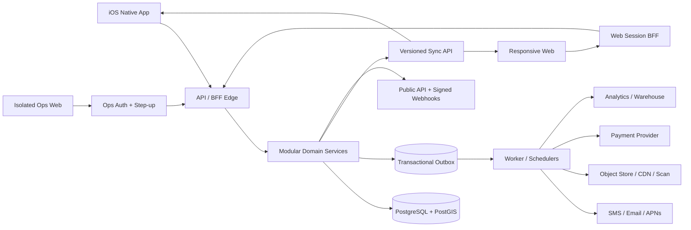

# Spott 产品工程唯一事实来源与完整开发交接

> **文档级别：ACTIVE / CANONICAL / SINGLE SOURCE OF TRUTH**  
> **生效日期：2026-07-19（Asia/Tokyo）**  
> **当前版本：1.0**  
> **适用仓库：`/Users/yaokai/Code/xingyu/Spott`**  
> **当前工程基线：`main@1a1684e`**  
> **产品所有者决策：本文档为唯一事实来源**

---

## 0. 文档权威性与使用方法

### 0.1 本文档取代什么

从本文档生效起，下列文档只作为历史证据，不再拥有当前状态、优先级、完成度或产品决策的解释权：

- `docs/Spott-总纲-产品工程与超越路线-20260718.md`
- `docs/Spott项目交接文档-20260718.md`
- `docs/SPOTT_FULL_PRODUCT_AUDIT.md`
- `docs/Spott-本地代码与产品开发计划完成度审计-20260718.md`
- `docs/Spott项目交接文档-20260716.md`
- `docs/Spott项目即时进度交接-20260716-0936.md`
- `docs/superpowers/plans/` 下所有旧计划中的复选框状态

产品功能 DOCX、全栈开发 DOCX 和同源 Markdown 副本仍然是需求背景与历史契约，但如果与本文档冲突，以本文档为准。

### 0.2 任何人或 AI 必须遵守的规则

1. 接手时先读本文档，不先读旧交接并按旧状态开工。
2. 任何“已完成”必须有当前 HEAD 的可重放证据；代码存在、旧测试结果、Turbo 缓存或截图不等于完成。
3. 任何实施计划只能作为本文档的执行附件，不能建立第二个事实源。
4. 状态、决策、阻塞、验收证据和下一步必须回写到本文档。
5. 不得用“页面已写”“接口已有”“编译通过”替代跨端、异常、性能、安全和生产验收。
6. 竞品能力每 90 天从官方来源重新核对；不得长期使用过期的 Luma/Meetup 印象。
7. 未经产品所有者明确更改，不新增 Android 产品范围。

### 0.3 文档更新协议

每次修改本文档时必须同时更新：

- 版本号与更新日期。
- 对应的 Git HEAD。
- 改变的决策、能力状态和阶段门。
- 新鲜验证命令、退出码和证据路径。
- 变更日志，说明为什么改。

---

## 1. 执行结论

### 1.1 北极星

**Spott 要成为日本首选的高信任城市活动与社群平台：兼具 Luma 的活动、票务和主办方体验，Meetup 的社群、成员关系和持续参与，并在日本本地化、中日英跨语言、线下履约信任、安全隐私、跨端一致性与视觉品质上可量化地超越两者。**

### 1.2 当前真实状态

2026-07-19 检查时，仓库仍为 `main@1a1684e`，没有晚于 2026-07-18 完成度审计的新代码提交。因此当前基线仍是：

| 口径 | 加权原始值 | 管理中心值 | 当前判断 |
| --- | ---: | ---: | --- |
| 产品功能覆盖 | 69.84% | 70% | V1 核心代码已过原型期，但跨端与体验仍有断口 |
| 开发计划 DoD 闭环 | 58.27% | 58% | 实现资产多，当前门禁、E2E 和生产证据不足 |
| 生产上线准备 | 26.34% | 26% | 外部服务、IaC、SLO、恢复、合规和发布门未闭环 |
| 旧计划复选框回填 | 116/528 | 22% | 只反映旧计划维护，不代表代码完成度 |

完整复算证据保留在：

- `docs/quality/local-completion-audit-20260718.csv`
- `docs/quality/local-completion-analysis-20260718.ipynb`
- `docs/Spott-本地代码与产品开发计划完成度审计-20260718.md`

### 1.3 “100% 完美”的工程定义

“100% 完美”不表示永远不会出现缺陷，而是同时满足以下八个可审计条件：

1. 本文档定义的所有范围内功能已经在 iOS 和 Web 完成等价交付。
2. 中、日、英三语的文案、格式、SEO、邮件、推送、法务与无障碍全部验收。
3. 所有当前 HEAD 的必需门禁全绿，不使用过期或缓存结果。
4. 十条 P0 与本文档新增的竞品超越场景已经用真实 PostgreSQL、Web 真浏览器和 iOS 模拟器/真机连续跑通。
5. 短信、邮件、推送、OAuth、对象存储、支付和 App Store 环境已使用真实凭证验收。
6. 生产基础设施、监控、告警、备份、恢复、安全响应和 Runbook 经过演练。
7. 无已知 P0/P1 缺陷，性能、稳定性、安全、无障碍和隐私达到本文档门槛。
8. 经用户测试和真实上线数据证明，核心任务成功率、速度、信任和偏好度优于同期 Luma/Meetup 对照基线。

只有八条全部通过，才能在本文档将项目状态改为 `100% ACCEPTED`。

---

## 2. 已锁定的产品决策

| 决策 | 最终口径 | 实施影响 |
| --- | --- | --- |
| 事实源 | 本文档是唯一事实来源 | 旧文档全部降级为历史证据 |
| 首发市场 | 日本 | 时区、手机号、地址、税务、隐私和支付先按日本验收 |
| 客户端 | iOS 原生 + 响应式 Web | 两端均必须交付核心闭环；Android 不计入本轮 100% |
| 语言 | 简体中文、日文、英文 | 所有用户界面、通知、法务、SEO 和客服模板均等价 |
| 支付与票务 | 最终包含平台票务代收、退款、会员和订阅；分阶段上线 | 首先发布不代收安全版；法律、主体、Stripe 和税务就绪后开启支付域 |
| 消息 | 安全优先的受控私信 | 活动/群讨论开放；仅共同活动、同群、组织者联系或双方同意后可私聊 |
| 陌生人私信 | 默认禁止 | 不把无限制私信当成“竞品对等”，用同意、限制和审核建立更高的安全标准 |
| 社群与组织 | 同时支持个人主办、群组、组织/日历中枢 | 补周期活动、多主办、现场 Staff、在线/混合活动和跨群网络 |
| 认证局头 | 正式版启用分级认证 | 个人身份、企业/组织、场地与高风险类别分级；不再用手机验证冒充认证 |
| AI 海报 | 真 AI 设计助手 + 可确定模板引擎 | 输出必须可预览、可编辑、可审核；AI 失败时仍可用高质量模板发布 |
| 视觉模式 | iOS/Web 均支持浅色和深色 | 基于语义令牌、对比度、Reduce Motion 和系统设置验收 |

上表中未由用户逐条明示的执行细节，是根据“直接开始、目标超越 Luma/Meetup”采用的安全优先默认。只能由产品所有者在本文档的决策日志中更改。

---

## 3. 状态、证据和责任治理

### 3.1 统一状态机

| 状态 | 准入条件 | 能否对外声称完成 |
| --- | --- | --- |
| `NOT_STARTED` | 没有可用主线实现 | 否 |
| `IN_PROGRESS` | 有实施或分支，未达到完整实现 | 否 |
| `IMPLEMENTED_UNVERIFIED` | 代码主线存在，但当前验证不完整或为红 | 否 |
| `VERIFIED_LOCAL` | 当前 HEAD 的聚焦单测、集成、契约和构建通过 | 仅可说“本地验证” |
| `VERIFIED_CROSS_PLATFORM` | iOS + Web + API 同一业务场景连续验收通过 | 可说“功能交付” |
| `PRODUCTION_READY` | 真实外部服务、SLO、监控、恢复、合规和发布门通过 | 可说“可发布” |
| `ACCEPTED` | 产品所有者签字 + 上线数据满足 KPI | 可说“已完成” |

### 3.2 证据优先级

证据从强到弱为：

1. 生产可观测数据、真实用户任务结果、恢复/安全演练。
2. 当前 HEAD 的真实设备与真浏览器跨端 E2E。
3. 当前 HEAD 的 PostgreSQL 集成、并发、契约、安全和性能测试。
4. 当前 HEAD 的单元测试、类型检查、Lint 和构建。
5. 代码静态阅读。
6. 旧日志、旧截图、旧交接文档或口头说明。

低优先级证据不能推翻更新的高优先级证据。

### 3.3 角色责任

| 角色 | 必须签字的内容 |
| --- | --- |
| 产品所有者 | 范围、优先级、文案、价格、风险容忍度、最终验收 |
| 设计负责人 | iOS/Web 组件、响应式、深浅色、动效、截图矩阵 |
| 工程负责人 | 架构、契约、数据迁移、跨端状态和发布证据 |
| 安全负责人 | 威胁模型、身份、MFA、支付、运营后台、事件响应 |
| QA/验收负责人 | 场景矩阵、新鲜门禁、回归、证据归档 |
| 运维负责人 | IaC、SLO、监控、备份、恢复、Runbook |
| 日本法律/会计顾问 | APPI、特商法、资金决済、税务、退款、未成年人与活动责任 |

同一个人或 AI 可以承担多个执行角色，但支付、MFA、永久删除、灾备和生产发布必须有独立复核。

---

## 4. 产品定位、人群与核心价值

### 4.1 一句话产品定位

**Spott 是一个从“发现真实活动”延伸到“可持续社群关系”的日本城市生活平台，用可验证的履约、安全和跨语言能力降低陌生人线下见面的风险和摩擦。**

### 4.2 核心用户

| 用户 | 核心任务 | Spott 必须交付的结果 |
| --- | --- | --- |
| 参与者 | 找到合适、可信、能参加的活动 | 10 秒内看到相关活动，费用/风险/地点/状态清楚，报名到到场不迷路 |
| 外国人/跨语言用户 | 在不熟悉日语的情况下安全参与 | 三语一致、翻译可解释、日本地址/交通/礼仪/费用边界清晰 |
| 个人局头 | 快速发布、招募、审核、签到和复盘 | 手机也能完整运营，系统处理名额、通知、安全和数据 |
| 社群组织者 | 长期经营群组、周期活动、成员和会员 | 组织中枢、周期日历、多主办、受控沟通、会员与分析闭环 |
| 现场 Staff | 核验、签到、处理异常和紧急事件 | 最小权限、离线可用、操作可审计、不泄露多余个人信息 |
| 运营/客服/安全 | 审核风险、争议、付款和平台健康 | 真 MFA、RBAC、双人审批、审计日志、SLA 和可恢复操作 |

### 4.3 产品原则

- **真实状态优先**：客户端不猜名额、价格、权限、风险或最终状态。
- **安全优先于增长**：不为消息量、转化或收入放开骚扰、未成年人或资金风险。
- **履约优先于热度**：推荐和信誉更重视真实到场、守约和持续贡献。
- **两端同一产品**：iOS 和 Web 是同一个业务系统，不允许相互矛盾的规则。
- **渐进式披露**：不在未报名时暴露精确地址、联系方式或其他敏感信息。
- **失败也可完成任务**：弱网、离线、冲突、外部服务故障时有清晰退路。
- **不伪造竞品超越**：只用官方对标、真实用户测试和生产数据得出结论。

---

## 5. Luma / Meetup 官方能力基线与超越定义

### 5.1 官方来源（2026-07-19 复核）

Luma 官方资料：

- [Event Themes and Customization](https://help.luma.com/p/event-themes-and-customization)
- [Setting Up Ticket Types](https://help.luma.com/p/setting-up-ticket-types)
- [Waitlist](https://help.luma.com/p/waitlist)
- [Luma Calendar Overview](https://help.luma.com/p/luma-calendar-overview)
- [Calendar Memberships](https://help.luma.com/p/calendar-memberships)
- [Sending Newsletters](https://help.luma.com/p/sending-newsletters)
- [Event Insights](https://help.luma.com/p/event-insights)
- [Luma API](https://help.luma.com/p/luma-api)
- [Webhooks](https://help.luma.com/p/webhooks)

Meetup 官方资料：

- [Organizer Subscription prices overview](https://help.meetup.com/hc/en-us/articles/28677808413197-Organizer-Subscription-prices-overview)
- [Creating a repeating event](https://help.meetup.com/hc/en-us/articles/39795590048781-Creating-a-repeating-event)
- [Contacting other members and organizers](https://help.meetup.com/hc/en-us/articles/360002880111-Contacting-other-members)
- [Meetup Starter guide](https://help.meetup.com/hc/en-us/articles/30611329944461-Meetup-Starter-The-Complete-Guide-for-First-Time-Organizers)
- [What notifications Meetup can send](https://help.meetup.com/hc/en-us/articles/40708711818637-What-notifications-Meetup-can-send)

竞品价格、套餐、功能与平台覆盖可随时变化。本节是 2026-07-19 快照，不是永久事实。

### 5.2 能力对标矩阵

| 能力 | Luma/Meetup 当前官方基线 | Spott 当前 | Spott 最终超越标准 |
| --- | --- | --- | --- |
| 美观活动页 | Luma 有多主题、动效、颜色和轻/深变体 | 设计令牌和基础封面存在，主题编辑器缺失 | 三语、可访问、端间一致的主题系统；品牌套件、AI 助手、无图高质量默认封面 |
| 票种与票务 | Luma 支持多票种、审批、售卖周期、付费和灵活定价 | 多票种/优惠码/嘉宾名单后端壳存在，跨端和支付未闭环 | 日本币种、税务、3DS、Apple Pay/卡、退款、拒付、发票、对账和离线门票全闭环 |
| 候补 | Luma 支持容量、候补审批与付款预授权 | FIFO/审批/容量代码较强，当前跨端验收未闭环 | 不超售、可解释排队、即时通知、预授权/释放幂等、不允许付费插队 |
| 组织中枢 | Luma Calendar 支持团队管理、关注、新闻信、会员和活动网站 | 个人局头与群组为主，组织层缺失 | 个人、群组、组织三层兼容；多管理员、品牌页、组织日历和跨活动 CRM |
| 周期活动 | Meetup 支持周/双周/月重复与整系列取消 | 无 series/RRULE 领域模型 | 支持 RRULE、时区/DST、单场例外、整系列变更、通知与订阅日历 |
| 在线/混合活动 | Luma/Meetup 均有在线或混合能力 | 未形成完整链路 | 受权加入链接、主持人工具、时区、提醒、录制同意与泄露保护 |
| 社群与成员 | Meetup 以 Group 为中心，含成员、讨论、活动与组织网络 | 群组、角色、容量、讨论基础已存在 | 补成员目录、兴趣/技能、相册、周期社群、跨群网络、健康度分析和安全退出 |
| 私信 | Meetup 对部分订阅用户提供成员消息 | 受控讨论存在，完整私信不存在 | 不复制开放骚扰模式；关系条件 + 双向同意 + 限流 + 拉黑 + 举报 + 审核证据 |
| 会员与订阅 | Luma Calendar Memberships 支持免费/一次性/定期会员；Meetup 有组织者和成员订阅 | 积分和局部商业化存在，会员域缺失 | 免费/付费层级、审批、专属票/内容/价格、暂停/取消/恢复、账单和权益审计 |
| 营销沟通 | Luma 有 Newsletter/Blast/分组；Meetup 有群通知和 Pro 沟通 | 通知、频控、分享归因基础存在 | 同意驱动的人群分段、草稿/预览/定时、邮件/推送/站内协同和退订审计 |
| 数据和集成 | 两者均提供高级分析或 API；Luma 有 API/Webhook | 内部 OpenAPI 和漏斗基础存在，无公开平台 | 主办方健康仪表盘、数据导出、稳定公开 API、签名 Webhook、重放/幂等与开发者文档 |
| 信任和安全 | 竞品有常规账号/举报/支付安全 | 动态签到、地址分级、风险引擎、账本基础是强项 | 将 90 秒动态签到、信誉、安全路线、实名/组织认证与快速事件响应做成明显护城河 |

### 5.3 只有证明才叫“超越”

最终必须同时满足：

- 所选竞品能力基线覆盖率 100%，每个差异都有明确的合规替代或更好解法。
- 至少 5 个可被用户感知的独特优势：动态签到、履约信誉、日本安全本地化、三语跨语言和跨端可恢复。
- 核心任务用户测试成功率≥95%，中位完成时间比对照产品快≥20%。
- 在对照测试中，至少 60% 的参与者明确更愿意使用 Spott 完成同一任务。
- 不以降低安全、隐私、无障碍、稳定性或法律合规换取功能数量。

---

## 6. 当前 18 个产品域基线

| 产品域 | 当前功能覆盖 | 当前开发闭环 | 当前生产就绪 | 真实状态 |
| --- | ---: | ---: | ---: | --- |
| C 账号与身份 | 75.6% | 65.1% | 28% | `IMPLEMENTED_UNVERIFIED`；Web token 暴露、生产 OTP 未接 |
| D 发现搜索收藏 | 84.1% | 71.3% | 45% | `IMPLEMENTED_UNVERIFIED`；推荐深夜跨日测试失败，认证筛选不真实 |
| E 活动发布 | 77.8% | 66.1% | 35% | `IMPLEMENTED_UNVERIFIED`；完整草稿/媒体/审核 E2E 未验 |
| F 报名候补签到 | 81.6% | 65.0% | 45% | `IMPLEMENTED_UNVERIFIED`；Web 固定日期测试已过期 |
| G 群组与关系 | 76.4% | 67.1% | 38% | `IMPLEMENTED_UNVERIFIED`；新讨论端点和客户端契约不完整 |
| H 成就与信誉 | 58.3% | 53.8% | 25% | `IN_PROGRESS`；分类 slug 和真实认证依赖未闭环 |
| I 积分与 StoreKit | 76.0% | 64.8% | 18% | `IMPLEMENTED_UNVERIFIED`；真实 Sandbox、对账与退款未验 |
| J 费用边界 | 75.6% | 65.4% | 40% | `IMPLEMENTED_UNVERIFIED`；现有不代收边界存在，最终支付域尚未开始 |
| K 通知 | 72.6% | 61.5% | 18% | `IMPLEMENTED_UNVERIFIED`；Push 生产默认仍为 console |
| L 分享与归因 | 79.8% | 68.3% | 35% | `IMPLEMENTED_UNVERIFIED`；Universal Link/跨设备归因未验 |
| M 安全举报与审核 | 81.2% | 70.6% | 32% | `IMPLEMENTED_UNVERIFIED`；Ops MFA、权限和运营 SLA 未闭环 |
| N 商业化 | 56.9% | 48.6% | 12% | `IN_PROGRESS`；会员、订阅、支付、发票与工具包缺失 |
| O 运营后台 | 69.7% | 57.0% | 16% | `IMPLEMENTED_UNVERIFIED`；主分支只看 MFA 时间戳 |
| P 埋点与分析 | 64.0% | 54.0% | 15% | `IMPLEMENTED_UNVERIFIED`；无真实采集、看板、告警和质量运行证据 |
| Q 非功能与质量 | 46.0% | 34.0% | 8% | `IN_PROGRESS`；当前多门红，无真机/性能/SLO 证据 |
| R 异常恢复与同步 | 61.1% | 49.3% | 15% | `IN_PROGRESS`；SwiftData 初始化仍可 `fatalError` |
| S 配置与灰度 | 74.8% | 61.6% | 25% | `IMPLEMENTED_UNVERIFIED`；生产灰度与自动回滚未验 |
| T P0 验收与发布 | 32.4% | 20.0% | 5% | `IN_PROGRESS`；0/10 当前 HEAD 连续跨端场景通过 |

该表不随一次代码提交手动“凭感觉加分”。评分只能通过附件 CSV 同一权重模型复算。

---

## 7. 最终产品功能规格

### 7.1 账号、身份与用户资料

**必须交付**

- Apple、Google、邮箱和日本手机号登录，支持安全账号合并。
- Web 使用 Secure + HttpOnly + SameSite Cookie/BFF；禁止在 Web Storage 保存 access/refresh token。
- iOS 敏感凭证仅入 Keychain，设备转移、退出和账号切换不泄露数据。
- 手机验证按手机号、账号、设备、IP 和风险等级多维限流，生产投递 fail-closed。
- 个人资料、语言、时区、兴趣、访问性偏好、隐私和通知偏好跨端同步。
- 数据导出、更正、撤回同意、注销冷静期和可验证清除。

**完成门**：窃取 Web Storage 的对抗性测试无法获得长期凭证；账号合并、注销和设备丢失场景均用当前 HEAD 跨端验收。

### 7.2 发现、搜索、地图与推荐

**必须交付**

- 未登录即可浏览真实活动，不用登录墙阻断发现。
- 城市、距离、时间、分类、语言、费用、名额、风险和认证局头等筛选全部在服务端权威执行。
- 列表、地图、搜索结果和推荐流的余位、时间和可报名状态一致。
- 推荐可解释，支持“为什么推荐”、不感兴趣、隐私控制和新用户降级。
- 日本地址、车站、行政区、经纬度和准确地址披露策略分离。
- 收藏、关注组织/群组、搜索历史和清除操作跨端同步。

**超越标准**：新用户 10 秒内看到至少 3 个真实可参加活动；推荐不以付费置顶冒充个性化；地图无假坐标。

### 7.3 活动创建、主题与发布

- iOS/Web 均支持草稿、自动保存、预览、发布、修改、撤回、取消和复制。
- 活动类型覆盖线下、在线和混合，支持单场和周期系列。
- 主题引擎提供专业模板、品牌色、字体组合、封面焦点、浅/深变体、动效与对比度保护。
- AI 设计助手输入活动主题、风格和语言，输出可编辑素材；生成内容经安全检测和人工预览后才发布。
- 媒体系统支持直传、幂等重试、断点恢复、病毒/内容扫描、派生图、CDN 和删除生命周期。
- 风险引擎、精确地址权限、费用边界、取消规则和记录法务同意不得绕过。
- 多主办方、现场 Staff、审批人、财务人员和内容编辑使用最小权限。

### 7.4 报名、候补、票务与签到

- 报名前一屏内展示票种、价格、平台/局头收款边界、容量、候补、取消、地址披露和风险说明。
- 服务端在单个事务中确定最后名额、候补、积分和支付状态，客户端不乐观伪造成功。
- 候补支持 FIFO、审批、预授权/释放、超时、通知、返回队列和可审计人工调整。
- 门票支持多票种、票档、早鸟、优惠码、隐藏票、分组购票、Wallet Pass、转赠策略和现场售票。
- 签到使用 90 秒轮换动态码，支持最小数据离线名单、重复扫描幂等、补签审批、撤销、实时同步和证据审计。
- 只有实际到场才可触发履约、邀请、成就、评价和积分权益。

### 7.5 组织、日历、群组和社群

- `Organization` 是品牌和团队层，`Group` 是成员关系层，`EventSeries` 是时间层，`EventOccurrence` 是可报名的实际场次。
- 组织支持多管理员、品牌页、自定义域名、日历页、粉丝/成员、内容与跨活动分析。
- 周期活动使用 RRULE 及显式时区，保存单场例外、取消、移动和整系列修改的差异。
- 群组支持容量、角色、转让、解散、加入审批、成员目录、讨论、活动聊天、相册、规则和安全记录。
- 一个组织可管理多群组和多活动，一个活动可通过明确权限被多组织/群组协作，不复制冲突数据。
- 日历输出支持单场 ICS、可订阅 feed、Apple/Google/Outlook 导入与取消/更新同步。

### 7.6 受控消息、讨论与通知

- 活动讨论仅对符合活动权限的用户可用，结束后归档，风险事件可冻结。
- 群讨论支持主题、回复、表态、订阅、置顶、关闭、软删除和举报。
- 发起私信必须满足关系策略，首次请求需对方同意；默认关闭已读回执、在线状态和精确活跃时间。
- 所有消息支持拉黑、静音、限频、垃圾检测、举报、证据保全和未成年人策略。
- 站内、邮件、推送和短信统一使用通知偏好、静默时段、紧急绕过、去重和频控。
- 主办方广播和 Newsletter 需要受众预览、退订、投递健康、发送限制和审计。

### 7.7 认证、信誉、成就与安全

- 认证分为手机、个人身份、组织、场地和高风险主办资质；卡片只展示实际通过的级别。
- 分类必须有跨环境稳定 slug，成就和推荐不使用写死 UUID。
- 信誉以结构化履约事实为主：到场率区间、取消行为、组织贡献、裁决成立投诉与恢复时间。
- 成就规则版本化、可解释、可撤回、可重放，不因修规则篡改历史。
- 风险活动进入自动通过、人工审核、限制发布或拒绝之一，更新也必须重评。
- 用户安全中心提供行程分享、紧急联系、举报、拉黑、证据追加、处理状态与申诉。

### 7.8 积分、会员、支付与商业化

- 积分继续使用幂等双分录账本，区分付费、赠送和限制余额，任何更正通过冲正而非改余额。
- StoreKit 购买需 App Store Server API/Notification、事务去重、退款/拒付冲正、负余额和对账。
- 活动支付使用正式支付域：Order、PaymentIntent、Charge、Refund、Dispute、Payout、Invoice 和 Ledger 状态明确分离。
- 支付处理由合格的 PSP 托管卡数据，Spott 不接触完整卡号；Webhook 签名、重放、顺序错乱和重复投递可恢复。
- 会员层级支持免费、一次性和月/年订阅，可绑定专属活动、票种、价格、内容和社群权限。
- 不允许付费插队候补；付费权益不能购买安全、审核或信誉特权。
- 定价、平台费、税、退款、拒付、结算和退订在付款前用对应语言清晰披露。

### 7.9 主办方增长、分析和开放平台

- 联系人/参与者库支持合法导入、标签、来源、同意、去重、导出和删除。
- 营销工作台支持活动 Blast、Newsletter、定时、分段、预览、UTM、归因、打开/点击/退订和投递健康。
- 主办方仪表盘至少覆盖浏览→报名→到场→复购、候补、退票、收入、渠道、社群健康和安全。
- 公开 API 与内部 API 分开版本、权限、配额和 SLA；开发者可创建密钥、撤销、查看审计和管理 Webhook。
- Webhook 支持注册、活动更新、票务、签到、会员、退款和安全事件，具有签名、投递日志、重试、暂停和重放。

### 7.10 运营后台

- Ops 仅在独立域名运行，生产禁止开发头鉴权。
- 初始超级管理员通过离线引导或一次性密封凭证建立 TOTP/硬件因子；任何新管理员必须由已完成 MFA 的管理员审批。
- 高风险操作要求 step-up、最小数据范围、双人审批、理由、不可变审计和可恢复性。
- 后台模块覆盖用户、活动、群组、安全案件、支付/退款/争议、积分、通知、配置、认证、系统健康与数据权利。
- 所有紧急开关都有作用域、过期时间、变更理由、审批人和自动恢复策略。

---

## 8. iOS 与 Web 产品对等规则

### 8.1 对等不等于像素相同

| 层级 | 要求 |
| --- | --- |
| P0 业务结果对等 | 登录、发现、发布、报名、候补、付款、签到、消息、安全和账号权利必须在两端得到同一权威结果 |
| P1 能力对等 | 主办方日常运营不得被强制回桌面端；iOS 可针对相机、通知、Wallet、定位和触感优化 |
| P2 交互等价 | Web 可用宽屏表格/批量操作，iOS 可用导航栈/底部面板；必须保留状态、文案和可恢复语义 |
| P3 管理例外 | 仅 Ops 后台和极少数财务批量工具可 Web-only，必须在本文档显式记录理由 |

### 8.2 建议信息架构

**iOS 主导航**

1. 发现：推荐、搜索、地图、收藏。
2. 日程：报名、候补、票务、签到、过往活动。
3. 创建：草稿、模板、AI 助手、发布。
4. 社群：群组、组织、讨论、受控私信。
5. 我：个人资料、信誉、成就、积分/购买、设置与安全。

**Web 顶层结构**

1. 公开发现、搜索、地图、活动/组织/群组落地页。
2. 用户中心：日程、票务、通知、社群、积分、安全。
3. Studio：发布、活动、参与者、系列/日历、组织、会员、沟通、分析、支付、集成。
4. Ops：独立域名和独立安全会话。

### 8.3 跨端同步要求

- 线上操作在另一端 p95 3 秒内可见。
- 离线操作在恢复网络后 p95 30 秒内收敛。
- 关键链路（名额、支付、签到、积分、权限）不做客户端 last-write-wins。
- 草稿和内容编辑使用 `baseVersion` 和可解释三方合并；无法合并时保留两份内容。
- WebSocket 仅作为唤醒与延迟优化，真实状态由可重放同步 API 和服务端版本确定。

---

## 9. 设计系统与高级体验标准

### 9.1 设计方向

延续 **Tokyo Afterglow / 东京余光**：像一本会动的城市活动杂志，而不是票务后台或无尽社交信息流。

已有语义令牌保留并演进：Canvas、Surface、Ink、Muted、Twilight、Coral、Mint、Amber、Danger；不在页面中新增无语义颜色常量。

### 9.2 跨端组件契约

| 组件 | 必须统一的内容 |
| --- | --- |
| 活动卡 | 真实时间、地点精度、语言、价格边界、余位、主办信任、风险与推荐原因 |
| 行动栏 | 完全由服务端 `availableActions` 和当前状态驱动，文案包含操作结果 |
| 表单 | 标签不依赖 placeholder，错误与字段关联，键盘/语音输入/自动填充可用 |
| 状态页 | 空、错、离线、权限、限流、过期和风险状态都给出下一步 |
| 通知 | 类型、业动、深链、去重、已读和偏好跨端一致 |
| 危险操作 | 清楚后果、二次确认、正确焦点、可撤回或可恢复说明 |

### 9.3 访问性和响应式门槛

- WCAG 2.2 AA，文本对比度≥4.5:1，大文本/非文本按对应标准验收。
- iOS 支持 Dynamic Type 到最大访问性字号、VoiceOver、Switch Control、Reduce Motion、Reduce Transparency 和足够触控面积。
- Web 全键盘可操作，焦点可见，语义标题/表单/对话框/表格正确，屏幕阅读器不重复或遗失状态。
- Web 覆盖 320、375、390、768、1024、1440 像素宽度，无水平溢出，复杂表格在手机上转为可理解卡片或分步操作。
- 截图矩阵覆盖三语、浅/深色、大字号、空/错/弱网与核心角色。

### 9.4 视觉验收红线

- 禁止在没有数据时制造假活动、假坐标、假余位、假认证或假成功。
- 禁止因为想显得“高级”而降低可读性、点击区、状态清晰度或加载性能。
- 禁止 iOS 和 Web 各自发明不同的业务颜色、状态文案和图标语义。
- 主题和 AI 输出必须经对比度、敏感内容、版权提示和移动预览。

---

## 10. 目标系统架构

### 10.1 架构原则

- 保持模块化单体 + 可独立 Worker，不为了“高级”过早拆微服务。
- PostgreSQL 是业务事实来源；缓存、搜索索引、分析仓和客户端缓存可重建。
- OpenAPI 是客户端契约来源，任何客户端使用的新端点不得跳过契约。
- 外部投递使用 Outbox，重试可幂等，失败可观测，不在数据库事务中直接调不可靠第三方。
- 金额、积分、名额、签到、权限和风险不做最终一致的乐观伪造。

### 10.2 逻辑架构



### 10.3 目标域边界

| 域 | 拥有的数据/不变式 |
| --- | --- |
| Identity | 身份、会话、设备、验证、合并、注销、同意 |
| Organizations | 组织、团队、品牌、角色、日历、自定义域名 |
| Events | 模板、系列、场次、发布、风险、翻译、主题 |
| Registration | 票种可售性、容量、审批、候补、报名状态 |
| Attendance | 动态码、签到、补签、撤销、履约事实 |
| Communities | 群组、成员、角色、讨论、相册、关系条件 |
| Messaging | 对话许可、消息、限流、静音、举报证据 |
| Commerce | 订单、支付、退款、争议、结算、发票、会员、订阅 |
| Points | 双分录账本、付费/赠送余额、冲正、StoreKit 映射 |
| Trust & Safety | 认证、风险、举报、案件、裁决、申诉、安全限制 |
| Notifications | 模板、偏好、频控、渠道路由、投递和深链 |
| Growth | 联系人同意、受众、活动广播、归因、活动推广 |
| Analytics | 事件模式、漏斗、指标、数据质量、保留与隐私 |
| Integrations | API 密钥、OAuth scope、Webhook、投递、重放、配额 |
| Operations | 运营账号、RBAC、审批、配置、审计与紧急开关 |

### 10.4 数据模型演进顺序

1. 先为分类建立稳定 `slug` 和确定性种子，解除成就/推荐阻塞。
2. 建立 Organization/Team/Role，将现有个人局头兼容迁移为单人组织视图。
3. 建立 EventSeries/EventOccurrence/Exception，保持现有单场活动为单场系列的兼容路径。
4. 建立活动协作角色和 Staff assignment，替代单一 `organizer_id` 的能力上限。
5. 在法律和 PSP 设计审查通过后建立 Commerce 独立子域，不复用积分账本充当现金账本。
6. 建立 Membership/Entitlement，权益通过版本化策略计算，不在多张表复制布尔字段。
7. 建立 ConsentRelationship/Conversation，将受控私信与群讨论分离。

---

## 11. 安全、隐私、支付与合规

### 11.1 当前必须先修的安全断口

| 断口 | 当前证据 | 最终要求 |
| --- | --- | --- |
| Web 会话 | `apps/web/app/lib/client-api.ts` 将 access/refresh token 写入 `localStorage` | Cookie/BFF 完整切换，旧凭证迁移/撤销，XSS 对抗测试 |
| Ops MFA | 主线依赖 `mfa_enrolled_at`，真 TOTP 分支存在自助注册悖论 | 离线初始引导 + 已 MFA 管理员审批 + step-up + 安全恢复 |
| iOS 本地库 | `Spott/Core/Persistence/PersistenceStore.swift` 初始化失败直接 `fatalError` | 错误分类、草稿导出、安全重建、恢复 UI 和遥测 |
| 生产 OTP/Push | `.env.example` 默认 console，APNs 凭证空 | 真实日本短信/APNs/邮件，投递回执、降级、告警和 fail-closed |

### 11.2 威胁模型必须覆盖

- XSS 窃取、CSRF、会话固定、refresh 重放、密码/验证码喷洒和账号合并劫持。
- 开放重定向、SSRF、上传能力 token 篡改、恶意文件和内容审核绕过。
- 名额超售、候补插队、重复签到、积分重复发放、退款白拿、Webhook 重放和拒付洗钱。
- 越权查看精确地址、参与者信息、支付、安全案件或运营后台。
- 骚扰、跟踪、未成年人接触、群体举报攻击、证据污染和审核人员内部滥用。
- AI 海报的版权、敏感内容、人物冒用、误导信息和提示注入。

### 11.3 隐私与数据治理

- 数据分为公开、内部、敏感、高敏感和支付受控五级，每级有明确加密、日志、保留和导出策略。
- 地址、手机、安全证据、身份认证和支付标识使用字段级加密与可轮换密钥。
- 埋点默认数据最小化，用户同意与法律基础分开，不在日志中输出 token、精确地址、验证码或完整个人资料。
- 账号注销不直接破坏法定财务/安全记录，但必须去标识化并说明保留依据。

### 11.4 支付上线前置门

支付代收、会员收费或结算不得上线，除非同时满足：

- 日本合格主体与 PSP/Stripe 账户完成审核。
- 日本专业顾问对特商法、资金决済、消费税、适格请求书、退款、拒付和未成年人完成书面审查。
- 开发、Sandbox、预发和生产密钥分离，无任何卡数据进入 Spott 日志/数据库。
- 付款、退款、争议、结算和对账的重复、乱序、延迟和部分失败场景均验收。
- 客服、财务、安全、告警、Runbook 和人工审批已就绪。

---

## 12. 质量、性能、稳定性与发布门

### 12.1 当前门禁真实快照

2026-07-18 新鲜验证，2026-07-19 确认 HEAD 未变：

| 门 | 当前结果 | 不能误读的地方 |
| --- | --- | --- |
| 根 `pnpm check` | **失败** | Lint/TypeScript 通过；并行全门中 Worker 媒体测试 5s 超时，单独 Worker 35/35 通过 |
| API 单独测试 | **742 通过 / 1 失败 / 1 跳过** | 推荐测试使用“当前+3h”，东京深夜跨日导致预期漂移 |
| Web `test:unit` | **328 通过 / 28 失败** | 3 个 EventDetail + 25 个 RegistrationFlow，固定活动日期已结束；根 Web `test` 未覆盖该套件 |
| `test:quality:ci` | **133/134 通过** | 集成测试 manifest 被嵌套 `.claude/worktrees/` 拓扑影响 |
| Web 显式 tsc | **通过** | 必须独立保留，不能只看 Turbo 根类型检查 |
| Web 生产构建 | **通过** | 存在大于 500k 的 chunk 警告，构建通过不等于性能通过 |
| Ops 构建 | **通过** | 不等于真 MFA/生产权限验收 |
| OpenAPI | **有效，1 警告** | `/media/upload-attempts/{attemptId}` 与 `/media/{id}/complete` 路径模糊 |
| iOS 当前运行验收 | **未执行** | 审计开始时无已启动模拟器，旧 `.xcresult` 不代表当前 HEAD |

在上表全绿前，项目必须被定义为“开发中”，不是发布候选版。

### 12.2 必需本地门禁

```bash
cd /Users/yaokai/Code/xingyu/Spott
export PATH=/opt/homebrew/opt/node@24/bin:$PATH

pnpm install --frozen-lockfile
TURBO_FORCE=true pnpm lint
TURBO_FORCE=true pnpm typecheck
TURBO_FORCE=true pnpm test
TURBO_FORCE=true pnpm build
pnpm --filter @spott/web exec tsc --noEmit --incremental false
pnpm --filter @spott/web test:unit
pnpm test:quality:ci
pnpm check:generated
pnpm contract:lint
pnpm test:integration:postgres
pnpm test:e2e
pnpm test:load
```

每条命令都必须记录 HEAD、开始/结束时间、退出码、通过/失败数和证据路径。

### 12.3 iOS 发布门

- 锁定 Xcode、Swift、SDK、依赖解析与模拟器运行时。
- Debug 聚焦测试、Release 全量单测试、XCUITest 核心旅程、签名验证和生产配置扫描全部通过。
- iPhone 小屏、主流屏、大屏、iPad 兼容显示和当前最低支持 iOS 版本完成截图/交互验收。
- 真机完成通知、相机/扫码、定位、深链、Wallet、StoreKit Sandbox、后台/恢复和弱网。
- 无签名、无正式 entitlements、无 TestFlight 或无 App Review 资料不得记为发布完成。

### 12.4 性能、可用性与恢复门槛

| 指标 | 目标 |
| --- | ---: |
| API 月可用性 | ≥99.95% |
| 报名/候补/支付核心写 p95 | ≤800ms（不含用户第三方验证） |
| 普通读 API p95 | ≤300ms |
| 跨端在线收敛 p95 | ≤3s |
| 重连后离线收敛 p95 | ≤30s |
| Web LCP p75（移动） | ≤2.0s |
| Web INP p75 | ≤200ms |
| Web CLS p75 | ≤0.1 |
| iOS 无崩溃会话 | ≥99.95% |
| iOS 冷启动可交互 p75 | ≤2.0s（支持设备基线） |
| 最后一席 500 并发 | 0 超售、0 双重扣减、0 丢失候补 |
| RPO | ≤5min |
| RTO | ≤30min |
| 已知 P0/P1 | 0 |

### 12.5 Definition of Done

一项功能只有同时满足以下条件才能移到 `VERIFIED_CROSS_PLATFORM`：

- 产品规则、角色、状态机、错误和隐私边界明确。
- OpenAPI/数据库约束/同步版本与客户端类型一致。
- 先有可证明缺陷的红测试，后有实现与回归。
- 单测、PostgreSQL 集成、并发/幂等、Web E2E 和 iOS 场景均有当前 HEAD 证据。
- 三语、无障碍、弱网/离线、空/错/权限、安全和分析事件全部验收。
- 可观测、告警、灰度、回滚/恢复和 Runbook 已配套。
- 文档、证据包、本文档状态和变更日志已同步。

---

## 13. 产品、质量与超越 KPI

### 13.1 北极星指标

**月度真实履约用户数**：在过去 30 天内至少一次通过有效签到或经审核的履约事实参加活动的去重用户数。

该指标不把浏览、收藏、假报名或未到场计为核心价值。

### 13.2 产品漏斗

| 人群 | 必须看的漏斗 |
| --- | --- |
| 参与者 | 首次访问 → 有效活动曝光 → 详情 → 报名/候补 → 确认 → 到场 → 30/90 天复购 |
| 主办方 | 创建草稿 → 预览 → 发布 → 首个报名 → 有效到场 → 复盘 → 二次发布 |
| 社群 | 加入群 → 首次参与 → 有效贡献 → 二次活动 → 90 天留存 |
| 支付 | 选票 → 发起付款 → 3DS/验证 → 成功 → 入场 → 退款/争议/结算 |
| 安全 | 举报 → 分级 → 首次响应 → 处置 → 申诉 → 关闭 → 复发监测 |

### 13.3 信任与质量护栏

- 名额超售率 = 0。
- 重复积分/支付/签到事实 = 0。
- 精确地址未授权泄露 = 0。
- 重大安全举报达到内部响应 SLA 的比例 = 100%。
- 三语关键旅程翻译覆盖率 = 100%。
- 无障碍阻断级问题 = 0。
- 每日账本、名额、签到、Outbox 和分析事实不变式检查通过率 = 100%。

### 13.4 超越证据研究

- 每种语言至少 20 名目标用户，总样本≥60，平衡 iOS/Web、参与者/主办方和新/老用户。
- 核心任务：找活动、报名/候补、找票/签到、发布活动、管理参与者、建立周期社群、付费/退款和处理安全问题。
- 同一脚本分别测 Spott 与对照产品，记录任务成功、时间、错误、信心和偏好。
- 研究报告包含失败案例和原始记录，不只展示对 Spott 有利的截图。

---

## 14. 分阶段开发路线图

阶段按门依赖执行，不用日历猜测替代完成证据。后一阶段可做技术探索，但前一阶段未过门时不得宣布后一阶段完成。

### Phase 0：恢复可信工程基线

**目标**：让“绿”重新具有可信含义。

**工作包**

1. 修复 API 东京深夜跨日推荐测试，使用注入时钟/固定时区边界。
2. 将 Web EventDetail/RegistrationFlow 测试从日历时间脱钩，使用相对 fixture 或注入时钟。
3. 使根 `pnpm check` 真正包含 Web 主单测试，清除“根绿、Web 红”。
4. 修复 Worker 并行全门稳定性，不用简单无限提高 timeout 隐藏资源争用。
5. 将质量 manifest 的扫描边界限制为当前 Git 跟踪工作树，不受嵌套 worktree 影响。
6. 解除 OpenAPI 媒体路径模糊，保持生成物一致。
7. 新鲜重跑 iOS Release 单测试和核心 UI 烟测。

**退出门**

- [ ] 所有 12.2 必需本地门禁在当前 HEAD 退出 0。
- [ ] Web 主单测试在根门禁和 CI 内明确执行。
- [ ] iOS 当前 HEAD 有新 `.xcresult` 和可追溯模拟器环境。
- [ ] 本文档的门禁快照更新。

### Phase 1：安全、身份与可恢复基础

**工作包**

1. 完成 Web Cookie/BFF 会话切换、凭证迁移和应急回滚。
2. 以离线初始引导 + 已 MFA 管理员审批收口 Ops TOTP/step-up，不直接合入有自助注册绕过的分支。
3. 修复 SwiftData 启动恢复，保留草稿和可诊断证据。
4. 接入日本短信与真实 APNs/邮件预发环境，完成多维限流和失败告警。
5. 完成分类 slug 与分级认证数据模型。

**退出门**

- [ ] Web 长期 token 无法被任意脚本从 Web Storage 读取。
- [ ] Ops 初始引导、新管理员、丢失因子、恢复和高风险 step-up 对抗测试通过。
- [ ] 损坏 SwiftData 不再以无选择崩溃结束，草稿可恢复或可导出。
- [ ] 真实手机验证、推送和邮件在预发有可观测回执。

### Phase 2：V1 核心旅程跨端完整闭环

**工作包**

1. 登录/手机验证/注销。
2. 发现/搜索/地图/收藏。
3. 草稿/媒体/审核/发布/修改。
4. 报名/审批/候补/取消/签到/补签。
5. 群组/角色/讨论/安全。
6. 积分/StoreKit Sandbox/成就/分享归因。
7. Ops 下架/申诉/权限和跨端状态收敛。

**退出门**

- [ ] 第 15.1 十条 P0 全部在同一数据库和当前 HEAD 连续通过。
- [ ] iOS/Web 功能对等矩阵无 P0/P1 缺口。
- [ ] 三语、无障碍、弱网和两端收敛验收通过。
- [ ] 产品所有者对核心旅程截图/视频签字。

### Phase 3：高级感、主题与体验护城河

**工作包**

1. iOS/Web 组件契约、截图基线和视觉回归。
2. 活动主题、品牌套件、无图默认封面、动效和深浅色。
3. AI 设计助手、安全审核、成本/配额和模板降级。
4. 三语硬编码清零、日期/货币/地址/文案专业校对。
5. VoiceOver/键盘/Dynamic Type/WCAG 和性能预算闭环。

**退出门**

- [ ] 核心页面截图矩阵在三语、深/浅色、小/大屏、大字号全部签字。
- [ ] 主题与 AI 输出无对比度、安全、移动适配或版权阻断。
- [ ] Web Core Web Vitals 和 iOS 启动/滚动性能达到 12.4 目标。

### Phase 4：Luma 级主办方与活动运营

**工作包**

1. Organization/Team/Calendar 中枢与多主办/Staff。
2. RRULE 周期活动、单场例外、在线/混合活动和日历订阅。
3. 客户/参与者库、导入/导出、分段、Blast、Newsletter 和投递分析。
4. 参与者表格、批量操作、现场工具、Wallet Pass 和组织级分析。
5. 公开 API、签名 Webhook、自定义域名与嵌入式组件。

**退出门**

- [ ] 第 15.2 的组织者超越场景全部通过。
- [ ] 官方 Luma 能力基线无未说明缺口。
- [ ] 主办方用户测试成功率和时间达到 5.3 标准。

### Phase 5：Meetup 级社群与受控关系

**工作包**

1. 成员目录、兴趣/技能、群规、贡献和健康度。
2. 活动聊天、群讨论完善、相册与内容安全。
3. 受控私信、同意请求、拉黑/举报、未成年人与反骚扰。
4. 跨群组织网络、共享活动、联合主办和专属分析。

**退出门**

- [ ] 官方 Meetup 能力基线无未说明缺口。
- [ ] 骚扰、拉黑、举报、未成年人、群体攻击和审核证据场景通过独立安全复核。
- [ ] 社群用户测试达到 5.3 标准。

### Phase 6：会员、平台支付与商业化

**前置**：第 11.4 支付上线前置门必须通过。

**工作包**

1. 现金账本、订单、付款、退款、争议、结算、税与发票。
2. 完整票务结账、审批+预授权候补、现场售票和对账。
3. 会员层级、订阅生命周期、权益、专属票/内容/价格和账单。
4. 主办方套餐、平台价格、限额、试用、升降级和退订。
5. 财务 Ops、风险、客服、告警和人工恢复。

**退出门**

- [ ] Sandbox 与预发支付全场景、对账和灾备通过。
- [ ] 无未解释账本差额，无重复扣款/退款/权益。
- [ ] 日本法律、税务、会计与客服评审书面签字。

### Phase 7：生产工程、公测与“超越”证明

**工作包**

1. 东京区域 IaC、多故障域数据库、缓存/队列、WAF、Secret Manager、CDN 和独立 Ops。
2. 日志、指标、Trace、SLO、告警、安全监控、数据质量和成本监控。
3. 备份、恢复、区域/供应商故障、密钥轮换、事件响应和回滚演练。
4. TestFlight + Web 限量公测，三语用户研究和指标修复。
5. App Store 审核、法务页、隐私清单、客服、运营排班和生产发布。
6. 按第 5.3 和第 13.4 进行竞品对照测试，用结果而非口号判定超越。

**退出门**

- [ ] 预发与生产配置受控、无示例密钥、无 console 生产投递。
- [ ] SLO 达到 12.4，RPO/RTO 经实际演练。
- [ ] 30 天限量公测无已知 P0/P1，关键护栏满足。
- [ ] 竞品对照研究达到 5.3 标准。
- [ ] 产品所有者、工程、安全、运维和法律联合签字。

---

## 15. 必须连续跑通的验收场景

### 15.1 十条 P0 核心场景

1. **新用户发现**：未登录在 Web/iOS 查看东京真实活动，筛选/地图/语言一致，无假坐标。
2. **手机验证报名**：登录、日本手机验证、披露、报名、跨端 3 秒可见。
3. **最后一席**：500 并发抢一席，只有一人确认，其余进入正确候补，积分/支付不重复。
4. **候补收敛**：取消释放名额、递补/审批、通知、超时回收和两端状态一致。
5. **动态签到**：90 秒码轮换、离线扫描、重连去重、补签审批、一次奖励和评价资格。
6. **群组容量**：50 人容量、积分扩容、并发加入、转让/解散和审计一致。
7. **安全下架**：Ops 真 MFA 下架风险活动，公开页、分享、报名、iOS 缓存和精确地址立即安全收敛。
8. **StoreKit 重复/退款**：重复回调只发一次，退款/拒付冲正，余额不静默 clamp。
9. **数据库恢复**：从备份恢复后，账本、报名、签到、Outbox、同步游标和媒体一致，达到 RPO/RTO。
10. **三语与无障碍**：中日英、深/浅色、Dynamic Type、VoiceOver/键盘、Reduce Motion、弱网和离线完成核心旅程。

### 15.2 组织者/Luma 超越场景

1. 主办方在 iOS 用模板 + AI 助手创建高质量三语活动，Web 继续编辑，无冲突丢失。
2. 创建周期活动，修改单场时间/地点，整系列、通知和日历订阅正确。
3. 多主办与现场 Staff 完成发布、审批、签到和复盘，权限不越界。
4. 导入合法联系人、分段、发送预览过的 Newsletter/Blast，退订和投递健康正确。
5. 通过公开 API 创建活动、通过 Webhook 接收报名/签到，重复投递不制造重复事实。
6. 付费票、审批候补、退款、发票、拒付和结算完整贯通，无未解释差额。

### 15.3 社群/Meetup 超越场景

1. 用户加入群组、参加周期活动、进入活动讨论/相册并在结束后持续社群关系。
2. 两名同群/共同活动用户发起受控私信，对方接受后才能继续，拉黑后所有入口立即收敛。
3. 组织管理多个群组和联合活动，同一成员不被重复计数，权限和同意独立。
4. 免费/付费会员获得对应活动、票种、内容和价格，取消/失败续费后权益可解释收回。
5. 骚扰者被限流、拉黑、举报和审核，正常用户不因安全策略失去基本沟通能力。

---

## 16. 外部前置与所有者任务

| 类别 | 必须提供或完成的内容 | 阻塞的阶段 |
| --- | --- | --- |
| 日本短信 | AWS End User Messaging/Twilio/Vonage 账户、发送配置、日文模板、产品名 `Spott` | Phase 1/2 |
| Apple Developer | 正式 Bundle ID、Sign in with Apple、Associated Domains、APNs、StoreKit 商品、Server Notification、TestFlight | Phase 1/2/6/7 |
| Google Cloud | iOS/Web OAuth Client、正式回调域和密钥轮换 | Phase 1/7 |
| 邮件 | 域名、SPF/DKIM/DMARC、模板、投递回执、退订和投诉处理 | Phase 1/4/7 |
| 对象存储/CDN | 生产 Bucket、KMS、生命周期、CDN、病毒/内容扫描 | Phase 2/3/7 |
| AI 服务 | 供应商、商用条款、成本上限、内容安全、隐私和版权方案 | Phase 3 |
| 域名/TLS | `spott.jp`、`api.spott.jp`、独立 Ops 域、Universal Links | Phase 2/7 |
| 云平台 | 东京区域账户、网络、HA 数据库、Redis/队列、Secret Manager、WAF、监控 | Phase 7 |
| PSP/支付 | 日本主体、Stripe/PSP 商户审核、结算账户、税务信息 | Phase 6 |
| 法律/会计 | APPI、特商法、资金决済、消费税、适格请求书、未成年人、活动责任、退款/拒付 | Phase 6/7 |
| 客服/运营 | 运营账号、轮班、SLA、话术、安全升级、财务对账和事件响应责任人 | Phase 6/7 |

外部前置未完成时，工程可完成本地/Sandbox 准备，但不得将对应能力改为 `PRODUCTION_READY`。

---

## 17. 风险登记

| 风险 | 概率/影响 | 当前控制 | 必须补强 |
| --- | --- | --- | --- |
| 文档声称绿、真实门禁红 | 高/高 | 本文档取代旧总纲 | 当前 HEAD 自动证据快照 + 严格状态机 |
| Web 凭证被 XSS 窃取 | 中/极高 | CSP/BFF 基础存在 | 完成 Cookie 切换、迁移和对抗性测试 |
| Ops 高权账号被接管 | 中/极高 | 主线依赖 MFA 时间戳 | 离线引导、真 TOTP/硬件因子、管理员审批、step-up |
| 测试因日期/环境漂移 | 高/高 | 已找到当前案例 | 可注入时钟、固定时区、仓库边界扫描 |
| iOS 本地库损坏启动崩溃 | 中/高 | 有同步/隔离测试 | 分类恢复、草稿导出、受控重建、遥测 |
| 最后名额/支付/退款跨端漂移 | 中/极高 | 后端代码和局部测试强 | 真 PG 并发 + 跨端 E2E + 不变式告警 |
| 支付法律/财务模型错误 | 中/极高 | 当前不代收边界 | 法律前置门、现金账本独立、PSP 托管、对账/灾备 |
| 社交功能引入骚扰 | 高/高 | 已选受控私信 | 关系策略、双向同意、限流、未成年人和审核证据 |
| AI 海报安全/版权/成本 | 中/高 | 只有静态壳 | 模板降级、人工预览、安全扫描、配额、供应商条款 |
| 无法证明超越竞品 | 高/中 | 已建官方基线 | 90 天复核、三语用户研究、任务数据和生产 KPI |
| 发布后无法恢复 | 中/极高 | 有本地 Docker/部分 CI | 生产 IaC、备份、RPO/RTO 演练、Runbook、轮班 |

---

## 18. 当前仓库交接

### 18.1 工程资产

| 资产 | 当前值 |
| --- | ---: |
| Git 跟踪文件 | 727 |
| 测试/spec 文件 | 142 |
| Swift | 74 文件 / 33,501 行 |
| TypeScript（不含生成 schema） | 277 文件 / 57,566 行 |
| TSX | 117 文件 / 19,386 行 |
| SQL | 30 文件 / 4,948 行 |
| 数据库迁移 | 28 |
| OpenAPI | 134 paths / 153 operations |
| Web 页面路由 | 31 |
| iOS 本地化键 | 每语言 858 + 327 |
| GitHub Actions workflow | 4 |
| 已跟踪生产 Terraform | 0 |
| 已跟踪生产 Runbook | 0 |

### 18.2 主要目录

| 路径 | 责任 |
| --- | --- |
| `Spott/` | iOS SwiftUI App、核心状态、同步、持久化、设计系统和系统集成 |
| `apps/web/` | 公开 Web、用户中心和 Studio |
| `apps/ops/` | 运营后台 |
| `services/api/` | 业务 API 和权威状态 |
| `services/worker/` | Outbox、媒体、投递、定时与派生任务 |
| `packages/contracts/` | OpenAPI 契约 |
| `packages/api-client/` | 生成客户端类型 |
| `packages/domain/` | 共享领域类型/不变式 |
| `packages/design-tokens/` | iOS/Web 语义设计令牌 |
| `packages/analytics/` | 分析事件和指标基础 |
| `database/migrations/` | PostgreSQL/PostGIS 迁移 |
| `infrastructure/docker/` | 本地基础设施 |
| `infrastructure/deploy/ip-preview/` | IP 预览，不是生产 IaC |
| `docs/quality/` | 质量证据和完成度附件 |

### 18.3 立即接手的代码入口

| 工作 | 主入口 | 相关测试/计划 |
| --- | --- | --- |
| Web 会话安全 | `apps/web/app/lib/client-api.ts` | `apps/web/tests/session-storage-exposure.test.ts`、`docs/superpowers/plans/2026-07-16-web-session-security.md` |
| API 推荐时间 | `services/api/src/modules/events/events.service.ts` | `services/api/src/modules/events/events.service.spec.ts` |
| Web 过期 fixture | `apps/web/tests/EventDetail.test.tsx`、`apps/web/tests/RegistrationFlow.test.tsx` | `apps/web/package.json` 主单测试入根门 |
| Worker 并行稳定 | `services/worker/test/`、`services/worker/src/` | 根 `pnpm check` 与单独 Worker 结果对比 |
| 质量扫描边界 | `tests/quality/integration-coverage.json`、`tests/quality/*.test.mjs` | 嵌套 `.claude/worktrees/` 对抗场景 |
| Ops MFA | `services/api/src/modules/auth/`、`apps/ops/` | `fix/ops-mfa` 只作参考，不直接合并 |
| iOS 启动恢复 | `Spott/Core/Persistence/PersistenceStore.swift`、`Spott/SpottApp.swift` | `docs/superpowers/plans/2026-07-17-ios-persistence-bootstrap-recovery.md` |
| 生产 OTP | `fix/otp-delivery` worktree/branch | 接凭证前复核与 main 差异，不假设可直接合并 |
| 票务壳 | `services/api/src/modules/tickets/`、`database/migrations/0027_ticketing_shell.sql` | 需补 OpenAPI、Web、iOS 与最终 Commerce 域 |
| 群讨论 | `services/api/src/modules/groups/groups.discussion.spec.ts`、`database/migrations/0024_group_discussion_reactions.sql` | 需补客户端契约与受控私信独立域 |

### 18.4 现有分支/worktree 处理规则

- `main@1a1684e` 是本文档基线。
- `fix/ops-mfa@aa21670` 含有价值的 TOTP 实现，也含已知引导绕过；只能挑选安全部分或在新设计下重做。
- `fix/otp-delivery@072a2c9` 保留投递抽象/AWS 适配器；需基于当前 main 重新复核。
- `.worktrees/web-session-security` 与 `.worktrees/core-journey-ui` 是历史工作树，不代表当前主线完成。
- `.claude/worktrees/magical-faraday-6eb253` 会影响当前质量扫描，不得在未确认所有权时删除。
- 不使用 `git reset --hard`、`git clean -fd`、未经确认的全量 stash 或删 worktree。
- 提交时精确加入本任务文件，不使用 `git add -A` 吸收其他人的本地改动。

### 18.5 本地启动

```bash
cd /Users/yaokai/Code/xingyu/Spott
cp .env.example .env
export PATH=/opt/homebrew/opt/node@24/bin:$PATH
pnpm install
pnpm infra:up
pnpm db:migrate
pnpm db:seed
pnpm dev
```

默认地址：Web `http://localhost:3000`、Ops `http://localhost:3001`、API `http://localhost:4100/v1`、Mailpit `http://localhost:8025`、MinIO `http://localhost:9101`。

本地 `.env` 只用于本机进程，不写回真实密钥，不因本地 console OTP/Push 工作就声称生产可用。

---

## 19. 下一位开发者 / AI 的强制开工顺序

1. 读本文档、`git status`、`git worktree list`、当前 HEAD，保护未提交工作。
2. 不立即开新功能；先执行 Phase 0 并产出可信绿基线。
3. 一次只取一个可独立复核的工作包，先写可证明问题的红测试。
4. 修复后跑聚焦门，再跑受影响工作区门，最后跑根门和跨端场景。
5. 安全、支付、名额、签到、积分、恢复和运营权限在完成前要求独立对抗复核。
6. 完成一个工作包后更新本文档的状态、证据、分支/HEAD、风险和下一项。
7. 只提交本工作包文件，保留用户与其他 AI 的本地改动。

**第一执行批次固定为 Phase 0，顺序是：**

1. API 时钟漂移测试。
2. Web 固定日期测试。
3. Web 主单测试纳入根门/CI。
4. Worker 并行稳定。
5. 质量 manifest 仓库边界。
6. OpenAPI 媒体路径歧义。
7. iOS 当前 HEAD 新鲜运行证据。

不得跳过这一批直接去做新页面、AI 海报、会员或支付。

---

## 20. 进度回写模板

每个工作包完成后，在本文档的变更日志添加：

```text
日期/时区：
工作包：
负责人/任务：
起始 HEAD：
结束 HEAD：
改动文件：
已通过门禁：
证据路径：
未通过或未执行：
状态变更：
新风险/已解除风险：
回滚/恢复方法：
下一项：
```

“未执行”必须明确写出，不允许留空造成默认通过。

---

## 21. 全局发布候选检查清单

### 21.1 产品与设计

- [ ] 范围内功能在 iOS/Web 对等矩阵中全部 `VERIFIED_CROSS_PLATFORM`。
- [ ] 中日英全量专业校对，无用户可见硬编码遗漏。
- [ ] 浅/深色、响应式、大字号、VoiceOver/键盘和 Reduce Motion 签字。
- [ ] 空、错、离线、权限、冲突、限流和风险状态有下一步。
- [ ] 竞品官方基线在 90 天内复核。

### 21.2 工程与安全

- [ ] 当前 HEAD 的全部本地/CI/iOS/集成/E2E/性能门全绿。
- [ ] 无 Web Storage token、无 Ops 假 MFA、无生产开发头鉴权。
- [ ] 无已知 P0/P1 安全、数据丢失、账本、超售或权限缺陷。
- [ ] 数据迁移、回滚/前滚、备份和恢复完成实际演练。
- [ ] 密钥、依赖、供应链、安全扫描和渗透复核通过。

### 21.3 生产与运营

- [ ] 生产 IaC、独立环境、域名/TLS、WAF、监控、告警和成本护栏就绪。
- [ ] 短信、邮件、APNs、OAuth、存储/CDN/扫描和支付真实投递验收。
- [ ] SLO、RPO/RTO、Runbook、轮班、客服、安全事件和财务对账演练。
- [ ] APPI、特商法、资金决済、税务、未成年人、活动责任与 App Store 资料签字。

### 21.4 验收与超越

- [ ] 十条 P0、组织者和社群超越场景全部连续通过。
- [ ] 三语用户研究达到任务成功、速度和偏好目标。
- [ ] 30 天限量公测护栏达标，无严重未解决信号。
- [ ] 产品、设计、工程、安全、运维和法律联合签字。

---

## 22. 参考文档与证据

### 22.1 需求源

- `docs/Spott产品功能文档-V1-完整版-20260713.docx`
- `docs/Spott-iOS-Web全栈开发文档-V1.0-20260715.docx`
- `Spott/docs/_work/source_product_doc.md`
- `Spott/docs/_work/spott_development_spec.md`

### 22.2 当前审计证据

- `docs/Spott-本地代码与产品开发计划完成度审计-20260718.md`
- `docs/quality/local-completion-audit-20260718.csv`
- `docs/quality/local-completion-analysis-20260718.ipynb`

### 22.3 执行附件

`docs/superpowers/plans/` 中的旧计划可以用于定位代码和历史工作，但其复选框不具有当前权威性。新实施计划必须：

- 引用本文档的具体阶段和退出门。
- 说明精确文件、接口、TDD 步骤、验证命令和提交边界。
- 不重新定义产品范围或完成度。
- 完成后将证据回写本文档。

---

## 23. 决策与变更日志

### 2026-07-19 · v1.0

- 建立本文档为唯一事实来源。
- 以 `main@1a1684e` 和 2026-07-18 新鲜完成度审计为真实基线，取代旧总纲的过期全绿声称。
- 确认日本首发、iOS + Web、中日英三语、Android 不在本轮范围。
- 确认最终包含平台支付/退款/会员/订阅，但在生产基础和日本合规后分阶段上线。
- 确认安全优先受控私信，禁止无限制陌生人骚扰式私信。
- 使用 2026-07-19 Luma/Meetup 官方资料建立竞品基线和 90 天复核规则。
- 将“100% 完美”改写为可审计的功能、跨端、质量、生产、合规和用户证据门。

---

## 24. 当前对外口径

> **Spott 当前是一个核心功能代码约完成 70%、工程 Definition of Done 约闭环 58%、生产就绪约 26% 的 iOS + Web 开发中产品。它已建立活动履约、信任安全、积分账本、跨端同步和三语产品骨架，但当前门禁不是全绿，安全恢复、跨端 E2E、竞品对等能力和生产运维尚未闭环。“超越 Luma 和 Meetup”是经过本文档路线图和量化研究要实现的目标，不是当前已达成的事实。**

