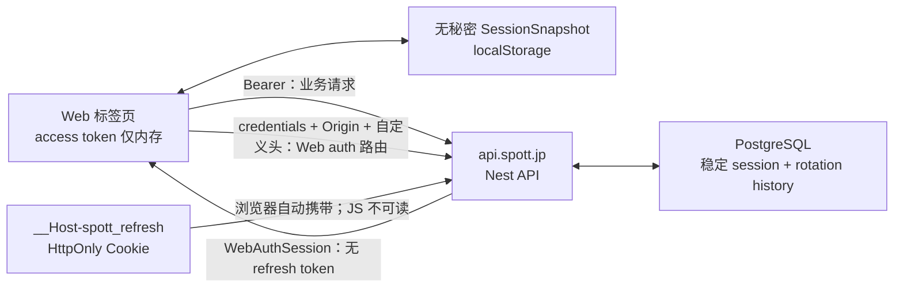

# Spott Phase 0.1 Web 会话安全迁移设计

## 状态

- 阶段：设计待产品负责人批准
- 批次：Phase 0 的第一个纵向批次
- 生产代码：尚未修改
- 评审：两轮独立安全复核完成，当前无 blocker/high
- 设计依据：`SPOTT_FULL_PRODUCT_AUDIT.md` 的 P0-2 与 `CODEX_DEVELOPMENT_PROMPT.md` 的首批启动语

## 1. 用户问题与批次边界

当前 Web 把 access token 与 30 天 refresh token 一起序列化到 `localStorage`。任何同源脚本一旦被注入，都可以读取并外传长期凭据。与此同时，当前刷新、复用检测和登出链路还有并发与事务缺陷：并发 401 会各自刷新；服务端在事务内记录复用后立即抛错，导致记录被回滚；撤销 session 后，既有 access JWT 仍可继续使用最多 15 分钟。

本批的目标是交付三个可观察结果：

1. 新登录、页面恢复和旧会话迁移后，Web 的 refresh token 只存在于 API 域的 HttpOnly Cookie 中；access token 只存在于当前标签页内存中；任何 Web 存储、事件、日志或分析事件都不含 token。
2. 同标签和多标签并发刷新不会误判攻击；真正的已消费 refresh token 复用会持久记录并撤销整个 refresh family；撤销后旧 access token 立即失效。
3. 当前设备登出、全部设备登出、单独撤销其他设备、离线登出和跨标签登出具有明确且测试覆盖的行为，不会生成“僵尸”新会话。

本批还修复两个与会话边界直接相关的问题：登录/手机验证后的同源安全跳转，以及登出时清理账户相关的敏感浏览器缓存。

## 2. 明确不做的事项

- 不新增 Apple、Google 或 ChatGPT Web 登录 UI；当前 Web 只有邮箱 OTP，OAuth 是后续独立产品批次。
- 不把所有业务 API 改为 Cookie 鉴权；业务请求继续使用短期 Bearer access token。
- 不在本批引入全站 SSR 路由保护、Vinext middleware 或完整 BFF。
- 不改动活动、群组、报名、支付、聊天或推荐领域行为。
- 不删除 iOS 使用的 refresh-token-in-body 契约；iOS refresh token 继续保存在 Keychain。
- 不借本批清理全仓历史 Lint/TypeScript 问题。现有 Web 四个 TypeScript 基线错误在本批不得增加，并在后续 P0 质量门批次归零。
- 不声称此批完成 Luma/Meetup 对等；它只是后续功能开发的安全前置条件。

## 3. 已验证的当前数据流

### Web

- `apps/web/app/lib/client-api.ts` 的 `spott.web.session.v1` 保存完整 `WebSession`，其中同时含 access token 与 refresh token。
- 每个请求从 `localStorage` 读 session 并设置 `Authorization`。401 后独立调用 `/auth/refresh`，成功后递归重试，没有 single-flight 或重试上限。
- 邮箱验证与账户合并均直接接收完整 token 响应并调用 `saveSession`。
- 当前 Web 是 Vinext/Cloudflare Worker 前端，浏览器直接访问独立 Nest API；仓库没有实际 BFF、Route Handler、middleware 或 proxy。
- `AccountControl` 仅监听本地 session 事件和 storage 事件；事件载荷当前也包含完整 token。
- 当前设备登出先捕获旧 session id，再走会自动刷新的通用请求。如果 access 已过期，刷新会创建新 session，重试却仍删除旧 id，因此留下未被客户端保存的“僵尸”session。

### API 与数据库

- 普通用户认证返回 JSON `AuthSession`，包括 access token 与 refresh token；Ops 已有独立的双 HttpOnly Cookie 先例。
- refresh 当前撤销旧 session row，再创建一个新 row；新 row 生成新的 `refresh_family_id`，family 实际没有延续。
- reuse 分支在事务中更新 `reuse_detected_at` 和撤销状态后立即抛错；数据库封装随后回滚，所以安全记录并未持久化。
- `AccessTokenGuard` 只验证 JWT，不读取 session、user 或 device 状态。登出、撤销、`loginBlocked` 或 blocked device 不会立刻使旧 access token 失效。
- `identity.sessions` 当前没有 last-seen、rotation generation 或已消费 refresh hash 历史。
- 邮箱 challenge 虽保存 `device_id`，verify 时却不读取或比较它；设备记录冲突时还会直接把同一个 device id 重新绑定给另一用户，而不先撤销旧用户在该设备上的 session。

### 部署边界

- 文档与默认配置声明 Web 为 `https://spott.jp`，API 为 `https://api.spott.jp/v1`。二者跨 origin、同 site。
- API 已使用精确 CORS allowlist 和 `credentials: true`；因此在上述生产域下可以让浏览器直接携带 API host-only Cookie。
- 仓库没有生产 DNS、TLS 或 Cloudflare route 证据，故“实际部署同站”仍必须作为发布硬门验证，不能仅根据默认字符串推断。

## 4. 方案比较与选择

### A. API 域 HttpOnly refresh Cookie，内存 access token（推荐）

浏览器继续直连 API。API 在 Web 专用认证路由上设置 host-only refresh Cookie，并只在 JSON 中返回短期 access token 和无秘密的用户/session 元数据。所有业务请求继续使用 Bearer token。

优点：

- 改动集中在认证纵向切片，不需要代理全部 API。
- 长期凭据不可被页面脚本读取。
- 业务 mutation 不依赖 ambient Cookie，因此 CSRF 面保持很小。
- iOS 原生契约可原样保留。

限制：

- `api.spott.jp` 的 host-only Cookie 不会发送给 `spott.jp` Worker，因此服务端页面不能据此做 SSR 登录判断；API guard 仍是真实安全边界。
- 生产 Web 与 API 必须保持 schemeful same-site。

### B. Vinext 同源 BFF（条件回退）

若实际生产 Web 不在 `spott.jp` site，例如只能使用第三方 preview/hosting 域，则在 Web origin 增加 Vinext Route Handler，由 BFF 保存 HttpOnly Cookie并代理认证刷新。

Vinext 当前版本支持 Route Handlers、cookies 和 workerd 运行时，因此技术上可行；但它新增代理边界、错误映射、流量和部署运维面。本批只有在生产同站硬门失败时才切换此方案，并需要单独更新设计后再实施。

能力核验来源为 [Vinext 官方仓库](https://github.com/cloudflare/vinext)；Fetch Metadata 的服务端判定模型依据 [W3C Fetch Metadata 规范](https://www.w3.org/TR/fetch-metadata/)。

### C. access 与 refresh 都放 Cookie（不采用）

这会让全部业务 mutation 依赖 ambient credentials，需要为全站重新设计 CSRF、SSR 和 API 客户端边界，明显超过本批范围，也没有必要。

### 决策

采用方案 A。批准该设计同时意味着批准以下发布约束：生产必须保持 `https://spott.jp` 与 `https://api.spott.jp` 同站；如果部署核验不满足，则停止发布并回到方案 B 的设计门，不会静默降级到 `SameSite=None`。

## 5. 目标架构



### 5.1 Cookie 规格

生产 Cookie 的唯一名称和属性为：

```text
__Host-spott_refresh=<opaque-token>;
Path=/;
HttpOnly;
Secure;
SameSite=Strict;
Max-Age=2592000
```

规则：

- 不设置 `Domain`，满足 `__Host-` host-only 约束。
- refresh 有效期为 30 天；服务端数据库 expiry 是权威值，Cookie Max-Age 只是浏览器上限。
- 写入、轮换和清除必须使用同一 name/path/secure/samesite 组合；清除使用 `Max-Age=0` 和过去的 `Expires`。
- 所有签发 access token 或设置/清除 refresh Cookie 的响应都包含 `Cache-Control: no-store` 和 `Pragma: no-cache`。
- 跨域响应按实际分支设置正确的 `Vary`（至少覆盖 `Origin` 与使用的 Fetch Metadata header），防止共享缓存混淆不同请求来源。
- 不采用 `SameSite=None`，不设置可被 Web JS 读取的 companion refresh Cookie。
- 本地 HTTP 开发使用单独名称 `spott_refresh_dev`、host-only、HttpOnly、`SameSite=Lax`、不设置 Secure；只在非 production 且 Web/API 都使用同一 hostname（统一 `localhost`，不混用 `127.0.0.1`）时允许。生产配置若尝试该模式必须启动失败。

### 5.2 API/BFF 边界

新增浏览器专用路由，现有原生路由保持兼容：

| 路由 | 鉴权/输入 | 行为 | 响应 |
| --- | --- | --- | --- |
| `POST /auth/web/email/verify` | OTP body + Web CSRF/Origin gate | 验证或自动注册、创建 Web session、设置 Cookie | `WebAuthSession`，不含 refresh token |
| `POST /auth/web/refresh` | refresh Cookie + device header + Web CSRF/Origin gate；无 token body | 原子 rotation或短时幂等恢复、重新设置 Cookie | `WebAuthSession` |
| `POST /auth/web/migrate` | 一次性旧 refresh token + device body、Web CSRF/Origin gate | 验证旧 token/device、原子 rotation、设置 Cookie | `WebAuthSession` |
| `DELETE /auth/web/session` | refresh Cookie + Web CSRF/Origin gate | 原子撤销当前 session/family并清 Cookie；不触发自动 refresh | `204` |
| `DELETE /auth/web/sessions` | refresh Cookie + Web CSRF/Origin gate | 撤销该用户全部 session并清 Cookie | `204` |
| `POST /auth/web/accounts/merge/commit` | Bearer + 同 sid refresh Cookie + merge body + Web CSRF/Origin gate | 合并领域效果幂等；沿用当前稳定 session并重签 access，不生成/持久化新 refresh secret | `WebAuthSession`，不改 Cookie |
| `GET /sessions` | Bearer | 返回当前用户的无秘密活动设备会话 | `{ items: SessionView[] }` |
| `DELETE /sessions/:id` | Bearer | 撤销指定自有 session；跨用户为 404 | `204` |

现有 `/auth/email/verify`、`/auth/apple`、`/auth/google` 和 `/auth/refresh` 继续返回 `AuthSession`，用于 iOS/受信任原生客户端。不能从这些主认证响应删除 refresh token，但必须切断浏览器对 raw-token transport 的访问。

原生 raw-token 路由增加 transport gate：任何带 `Origin` 或浏览器 Fetch Metadata 的请求都拒绝；没有这些浏览器 header 的现有 iOS 请求保持兼容。Web 只能调用 `/auth/web/*`。部署时允许一个有明确截止时间的兼容开关，让旧 Web先迁移到新路由；P0-2 只有在开关关闭、trusted Web Origin调用全部 raw-token签发/刷新路由都得到 403 后才算完成。该兼容开关不能变成永久 feature flag。

账户合并的领域幂等记录只能保存 `{jobId, targetUserId, completedAt}` 等无秘密 `MergeCommitReceipt`，禁止把 `AuthSession`、Cookie值、加密secret或任何 refresh token写入 `sync.idempotency_keys.response_body`：

- Web 首次与重放都沿用发起合并的 target session；从数据库当前状态重建 access/user响应，Cookie sid必须与Bearer sid一致。
- 原生 `/accounts/merge/commit` 改为返回同一个 `MergeCommitReceipt`，不再创建新session。iOS在收到receipt后保留当前target Keychain session，并通过现有single-flight `/auth/refresh` 取得更新后的用户claims/session视图。
- 合并领域写入只执行一次；并发重放和响应逆序只会得到相同receipt，不能重复搬迁业务数据、rotation或累计活动session。

这是本批唯一有意调整的iOS响应shape，OpenAPI与Swift客户端必须原子更新并通过构建/回归测试。实施前会先核对是否存在无法同步升级的已发布客户端；若存在，必须另开有明确sunset和兼容证明的版本化接口设计，不能保留会持久化token的旧实现。

当前 Web 没有 Apple/Google UI，所以本批不创建未使用的 Web OAuth 页面；未来任何 Web OAuth 签发点必须使用同一 Web Cookie response helper，禁止回退到把 refresh token 交给浏览器 JS。

`SessionView` 只暴露 `id`、`platform`、`createdAt`、`lastSeenAt`、`expiresAt` 和 `current`。当前没有可信设备名称、IP 位置或 User-Agent 数据，因此 UI 不伪造这些信息。

### 5.3 CSRF 与跨域模型

只有 `/auth/web/*` 使用 ambient refresh Cookie。每个会设置、刷新或清除 Cookie 的请求必须同时满足：

1. `Origin` 与解析后的 `WEB_ORIGIN` 精确匹配；缺失或 `null` Origin 一律拒绝。
2. `Sec-Fetch-Site` 为 `same-origin` 或 `same-site`；浏览器请求缺失时拒绝，测试/非浏览器只能走原生非 Cookie 路由。
3. 自定义头 `X-Spott-Session: browser-v1` 精确匹配。它强制跨 origin 请求先通过 CORS preflight。
4. 全局 CORS origin allowlist保持 `WEB_ORIGIN ∪ OPS_ORIGIN` 的精确并集，并只开放审计过的header集合。`/auth/web/*` 自己的Origin gate只接受 `WEB_ORIGIN`；`OPS_ORIGIN` 绝不能访问Web refresh Cookie路由。反过来，Ops Cookie路由继续只接受 `OPS_ORIGIN`。

`SameSite=Strict` 是附加防线，不替代 Origin 检查。业务 mutation 仍需 Bearer token，因此第三方表单即使能发请求也不能授权业务操作。

账户合并 Web endpoint 同时要求 Bearer、同 sid Cookie、幂等键和 Web CSRF gate。它虽然不替换 refresh secret，但会改变当前账号数据与 access context。

### 5.4 生产同站配置硬门

API 配置新增一个明确的 public API origin，并在 production 启动时验证：

- Web origin 和 public API origin 都是 HTTPS。
- public API host 是 `api.spott.jp`（或后续明确批准的 `spott.jp` 子域）。
- 每个允许的 Web origin 都是 `spott.jp` 或其明确配置的子域。
- Web session allowlist与 `WEB_ORIGIN` 完全一致；全局CORS则是 `WEB_ORIGIN` 与 `OPS_ORIGIN` 的精确并集。不接受 `*`、正则放宽或动态反射任意Origin，也不能为了Web Cookie迁移切断Ops origin。

发布 smoke test 必须在真实 staging/production-like 域验证 Cookie 实际被浏览器接收和发送。若任一条件失败，直接阻断方案 A 发布并触发 BFF 重新设计。

## 6. Rotation、并发、复用与撤销

### 6.1 稳定 session id

refresh 不再“撤销旧 row + 创建新 row”，而是在同一个锁定的 session row 上轮换 refresh secret：

- `session.id` 和 `refresh_family_id` 在整个登录生命周期保持不变。
- 每次成功 rotation 更新当前 `refresh_hash`、`expires_at`、`last_seen_at` 和 `refresh_rotated_at`。
- 新 access JWT 继续使用同一 `sid`。因此一个标签页轮换 Cookie 不会让其他标签页尚未过期的 access JWT立即失效。
- 当前 15 分钟 access 与 30 天 sliding refresh 语义保持不变；不在此批静默引入新的强制重新登录周期。

### 6.2 已消费 token 历史

新增 append-only migration `0016_web_session_security.sql`：

- 为 `identity.sessions` 增加 `last_seen_at` 与 `refresh_rotated_at`，并为活动 user/device/family 查询增加索引。
- 新增 `identity.session_refresh_history`，保存 `session_id`、`refresh_family_id`、已消费 token 的 HMAC hash、它的**直接后继** `replaced_by_hash`、短时 `replacement_secret_cipher/recovery_expires_at`、`consumed_at`、该版本原本的 `token_expires_at` 和 `reuse_detected_at`。长期历史只保存 hash，绝不保存旧或新明文 secret。
- 历史 hash 设置唯一约束，并按 session/family 建索引。已消费版本至少保留到它自己的 `token_expires_at`；在 rotation 或受控清理任务中删除已经不可能有效且超过审计保留窗口的记录，使表有明确上界，同时不把仍可能有效的旧 token 降级为“未知 secret”。
- 保留现有 `sessions.refresh_hash` 作为当前 token hash，避免破坏性重写历史迁移。

为了处理“数据库已经提交，但 `Set-Cookie` 响应丢失”，rotation用独立的 `SESSION_RECOVERY_ENCRYPTION_KEY` 对**直接后继** refresh secret做带AAD的短时AES-GCM加密，AAD绑定session id、family、旧hash和后继hash。恢复密文只允许在15秒窗口内解密，过期后在下一次rotation/访问及受控清理中置NULL；它不进入日志、幂等表或长期导出。备份即使短暂捕获ciphertext也不包含其独立运行时密钥。这个短时恢复窗口是并发容错，不是第二个长期token存储。

旧版本只能恢复它的直接后继，而且仅当 `sessions.refresh_hash == history.replaced_by_hash`。如果A已经rotation为B、B又rotation为C，提交A的客户端不得用A追到C；它只能使用浏览器已经共享的C Cookie，或得到不撤销family的409后重新同步。这限制了泄露旧token在grace window内“跨代升级”的能力。

使用历史表而不是只保留一个 previous hash，原因是：只有这样才能验证较早版本 token 的真实复用，同时避免“知道 session id、随便提交错误 secret 就能强制用户下线”的拒绝服务漏洞。

### 6.3 原子 rotation 算法

1. 解析 `sessionId.secret`，计算 HMAC；格式错误直接返回统一 401。
2. 事务内 `SELECT ... FOR UPDATE` 锁定该 `sessionId`，取得它的family，并检查 user、device、expiry、revoked/reuse 状态。Web refresh/migrate的 `X-Spott-Device-Id` 或迁移body device必须与session device一致。
3. 若 hash 等于当前 `refresh_hash`：生成一个新随机secret；把旧hash、直接后继hash与15秒后继恢复密文按 `(session_id, refresh_family_id, refresh_hash)` 写入history；更新同一session row，签发同sid的access token，提交后返回新token transport。
4. 若 hash 在**同一个** `session_id + refresh_family_id` 的history中命中：
   - 若它在15秒并发/响应丢失恢复窗口内被消费、后继恢复密文有效，且 `history.replaced_by_hash` 仍等于当前 `sessions.refresh_hash`，则解密直接后继并复核hash，幂等地重新返回该后继token和新access token，不再rotation。
   - 若仍在窗口内但恢复密文缺失、过期或校验不一致，返回已提交的 `409 REFRESH_RETRY`，不撤销family；这属于可观测异常，不能降级为新rotation。
   - 超出窗口则在同一事务中记录reuse，并撤销该 `refresh_family_id` 的所有活动session。事务返回outcome并先提交，再在事务外抛出 `401 REFRESH_TOKEN_REUSED`。
5. 若 hash 既不是当前值，也没有在同session/family的可信历史中命中，只返回通用401并记录不含token/session id明文的安全计数；不撤销用户session，避免伪造secret的下线攻击。全局命中另一session的history也必须按未知secret处理。
6. 任何错误分支都不生成新session。正常rotation只生成一个新secret；恢复分支只重发已经存在的当前secret。

### 6.4 设备与 challenge 绑定

`identity.devices.id` 继续表示一个安装实例；同一浏览器/原生安装不能同时归属两个活跃账号。创建 session 时必须锁定已有 device row：

- device 已属于同一用户时，只更新 platform/last-seen，保留 risk state。
- device 属于另一用户时，先原子撤销该 device 的全部旧 session并禁用其旧账号 push token，再重新绑定；不能留下仍可刷新的旧账号 session。
- blocked device 不能通过换账号重新绑定来清除 risk state或获得新 session。
- 邮箱 verify 必须比较 challenge 中原始 device id与请求 device id；不匹配时拒绝且不创建账号/session。Web与iOS都显式发送自己的 platform，修正iOS邮箱 session被标成web的问题。

这一规则符合当前客户端“一台安装同一时刻只有一个活动账号”的实际模型，又避免为本批重写 sync/device主键体系。

### 6.5 access guard 的即时撤销

JWT 签名验证成功后，guard 必须用 `sid + sub` 查询数据库并验证：

- session 存在、属于该 user、未过期、未 revoked、未 reuse-detected；
- user 为 `active`、`restricted` 或 `deletion_pending` 中仍允许登录的状态；`suspended`/`anonymized` 拒绝；
- `restriction_flags` 数组不包含 `loginBlocked`；
- device `risk_state` 不为 blocked。

同时检查 `users.deleted_at IS NULL`，且 session 的 device owner仍与 `sub` 一致。

`phoneVerified` 与 restriction context 使用数据库当前值，不能只信任 15 分钟前的 claim。`deletion_pending` 仍允许进入取消删除路径，不能被 guard 误锁死。

因此当前/全部/指定设备撤销提交后，旧 access JWT 的下一次受保护请求立即得到 401。

## 7. Web 客户端状态模型

### 7.1 存储边界

- access token：模块内存，页面 reload 后消失。
- refresh token：仅 HttpOnly Cookie，JS 无读取 API。
- `spott.web.session.snapshot.v2`：严格解析的无秘密 snapshot，可包含 `sessionId`、access expiry 和公开展示所需 user metadata；它不是鉴权依据。
- `spott.web.device.v1`：保留无秘密设备 UUID；读写捕获 storage 不可用异常。
- `spott.web.session.v1`：只作为一次性 legacy 输入，永不再写入。

任何 `CustomEvent`、`storage` 或 `BroadcastChannel` 消息只携带 `changed`、`logged-out`、版本号或已净化 snapshot，绝不携带 access/refresh token。

### 7.2 SessionProvider 与启动恢复

在根 layout 的客户端 provider 层增加窄范围 `SessionProvider`：

- 同步读取严格校验后的 snapshot，使正常 reload 不出现错误的“未登录”闪烁。
- 初始化时先处理 logout tombstone 和 legacy migration，再按需调用 Cookie refresh恢复内存 access token。
- 暴露 `loading / authenticated / anonymous / temporarily-unavailable` 状态。受保护客户端流程等待初始化完成，不能把“尚未恢复”当成匿名并立即跳登录。
- API 仍是权限真相；篡改 snapshot 只能改变短暂展示，不能获得受保护数据。

### 7.3 身份代次与跨标签刷新锁

每个标签维护单调递增的 `authEpoch`，并把当前 `sessionId + userId` 作为请求身份边界：

- 登录、登出、账户合并、storage/Broadcast身份变化都会先递增epoch并取消该标签中尚未完成的旧epoch请求。
- 每个authenticated请求在发出时捕获 `{authEpoch, sessionId, userId}`。401后refresh只有在返回的sid/user与捕获值完全相同时才允许重放原请求。
- 如果另一个标签已经登录为不同账号，refresh即使成功也只更新全局展示并抛出 `SESSION_IDENTITY_CHANGED`；旧请求绝不以新账号身份重放。GET和mutation都遵守同一规则。
- 账户合并虽保持target user和稳定sid，也递增epoch，因为权限、手机号、restriction和资源归属可能已经改变。

Web refresh还必须跨标签串行化：优先使用 Web Locks API；不支持时使用带过期时间和fencing token的localStorage lease，并用BroadcastChannel/storage唤醒等待者。锁覆盖“读取共享Cookie→收到并处理Set-Cookie响应”的完整区间；超时lease不能由旧持有者继续写状态。服务端短时幂等恢复是第二道防线，不能用来替代客户端互斥。

### 7.4 请求与刷新状态机

- 同一标签页只有一个共享 `refreshPromise`。
- authenticated 请求在没有有效内存 access 时先等待该 promise。
- 一个业务请求最多因 401刷新并重放一次；禁止递归无限重试。
- 已消费token在15秒窗口内通常由服务端幂等重发当前Cookie；`409 REFRESH_RETRY` 只用于恢复状态不一致，客户端在仍持有同一epoch/identity且重新取得跨标签锁后最多重试两次。
- refresh 返回 401/403/reuse 时清理内存和 snapshot并进入匿名状态。
- refresh 遇到网络错误或 5xx 时保留 snapshot，进入可恢复的暂时不可用状态，显示中/日/英重试文案；不得把服务暂时故障当作永久登出。
- refresh、migration 和 logout 路由本身从不经过通用 401 自动刷新，避免递归与“僵尸”session。

### 7.5 旧 localStorage 会话迁移

迁移采用安全优先、不可回写策略：

1. 严格校验 `spott.web.session.v1` 结构。
2. 将 legacy refresh token 仅保留在当前 JS 调用栈/模块内存，并立即从 `localStorage` 删除完整旧记录。
3. 携带当前device id调用 `/auth/web/migrate`。服务端验证token/session/device绑定、原子轮换并设置Cookie；成功后只保存无秘密snapshot。
4. 格式无效、token 失效、网络中断或服务器错误时都不把 token 写回 localStorage。清理内存并显示三语“为了保护账号，请重新登录”恢复路径。
5. API 先于 Web 部署，并在至少覆盖旧 refresh 最大寿命的迁移窗口内保留 migration endpoint；其后删除须另行审计。

这个选择可能在迁移时遇到网络故障的用户需要重新登录，但不会为了无感迁移继续暴露长期 token。

### 7.6 登出、多标签和敏感缓存

- 当前设备登出使用 Cookie-only `DELETE /auth/web/session`，不依赖可能已过期的 access token，也不走通用自动刷新。
- 全设备登出使用 `DELETE /auth/web/sessions`；成功后所有 session access 立即失效。
- 成功登出广播净化的 `logged-out` 事件，所有标签清除内存 access 和 snapshot。
- 当前设备离线登出时，立即清除本地认证展示并写入不含秘密的 `spott.web.logout-pending.v1` tombstone。启动和 `online` 事件只重试 Cookie logout，不允许先 bootstrap refresh；服务器确认并清 Cookie 后删除 tombstone。
- 用户明确重新登录成功时清除旧 tombstone。
- 登出或用户身份被账户合并替换时，清除 `spott.event-composer.v2` 与所有 `spott.group-transfer.*` 私有缓存；设备 id、语言和分析同意不属于账户秘密，可以保留。

### 7.7 安全跳转

新增一个共享的 `safeReturnTo`：使用 WHATWG `URL` 相对当前 origin 解析，并要求最终 `origin` 完全相同；拒绝反斜线、协议相对 URL、控制字符、绝对外域和解析失败。登录与手机验证共用它并保留安全的 path/query/hash。

## 8. 契约、错误和可观测性

### OpenAPI

- 新增 `WebRefreshSession` Cookie security scheme。
- 新增不含 refresh token 的 `WebAuthSession`、`MergeCommitReceipt`、`SessionView` 与 session list schema。
- 为所有 Web auth response 精确描述 `Set-Cookie`、`Cache-Control`、204、401、403、409 和 5xx。
- 保留主登录 `AuthSession` 与原生 `/auth/refresh` body contract；账户合并改为无秘密receipt并同步更新Swift调用方。
- 更新并核对 `openapi.bundle.yaml`；若有生成/手写客户端 schema，保持同步。

### 错误语义

- `401 AUTH_REQUIRED`：没有或已失效的 Cookie/session。
- `401 REFRESH_TOKEN_REUSED`：经可信历史验证的真实复用，family 已提交撤销。
- `403 WEB_SESSION_ORIGIN_INVALID`：Origin、Fetch Metadata 或自定义头不符合。
- `409 REFRESH_RETRY`：短时恢复状态不一致，请重新取得跨标签锁后有限重试，不清 session、不rotation。
- `409 SESSION_IDENTITY_CHANGED`（Web本地语义）：Cookie已切换到不同sid/user，取消旧请求且绝不跨身份重放。
- `503`/网络错误：暂时不可用，不删除本地 snapshot。

用户可见错误、loading、offline、retry 和 session list 操作必须在 zh-Hans、ja、en 三套资源中完整，并通过 live region/焦点恢复让屏幕阅读器可发现。

### 日志与指标

- 请求日志显式 redact `Authorization`、`Cookie`、`Set-Cookie`、`refreshToken`、`identityToken`、`idToken`、OTP code 和 merge token。
- 不记录 refresh hash、原始 session id、email、device id 或 response token。安全指标使用聚合计数，必要关联值用独立审计密钥做不可逆 HMAC。
- 最小指标：Web login/refresh 成功率、401、409 并发重试、可信 reuse、logout pending 重试和 migration 成功/失败；不发送 token 或 PII 到产品分析。

## 9. 预计修改边界

| 层 | 预计文件/职责 | 判定 |
| --- | --- | --- |
| Database | 新增 `database/migrations/0016_web_session_security.sql`；稳定 rotation、history、索引 | 必须 |
| API | auth service/controller、独立 Web session controller/helper、guard、config、CORS与日志 redaction | 必须 |
| Contracts | `openapi.yaml`、bundle、相关 schema | 必须 |
| Web | `client-api.ts`、SessionProvider、login、phone verification、account merge、settings/device sessions、三语资源 | 必须 |
| iOS | 保持 Keychain/body-token 模型；邮箱 verify 明确发送 `platform: ios`，补兼容回归测试 | 兼容性必须；不新增 UI |
| Worker/Outbox | 本批没有外部异步副作用；history 先在原子 rotation 中做有界清理，不依赖未接通的 Worker | N/A，说明原因 |
| Analytics | 只加无秘密的聚合安全事件/检查；不加用户级 token 数据 | 必须 |
| Accessibility | session loading/error/list/logout 控件的键盘、焦点、live region、44×44 与三语检查 | 必须 |
| Docs/Runbook | 本设计、部署顺序、同站 smoke test、回退与验收证据 | 必须 |

## 10. Red → Green 测试矩阵

所有行为变化先添加会因当前实现而失败的测试，并记录 Red 原因。不能用源代码正则替代核心行为测试。

| 层 | Red 场景 | Green 验收 |
| --- | --- | --- |
| DB integration | 当前 rotation 创建新 sid/family | rotation 后 sid/family稳定，当前 hash 更新，旧 hash进入 history |
| DB integration | reuse 更新被事务 rollback | 可信复用的 history/revocation 在错误返回前已 commit |
| DB integration | 并发使用同一token会误撤销；提交后响应丢失无法恢复 | 恰好一次rotation；并发/重试幂等取得同一个当前token；family仍活动 |
| DB integration | 已提交响应丢失、重试与响应乱序无覆盖 | 15秒内仅在直接后继仍current时恢复它；窗口后可信复用才撤销 |
| DB security | grace内旧A token可跨A→B→C取得最新C | A只可在B仍为current时恢复直接后继B；current=C时A绝不获得C |
| DB/security | 任意错误secret或跨session history命中可触发误撤销 | history始终限定sid+family；未知/他人secret只401且不撤销victim |
| DB/security | 幂等/恢复字段可能保存明文token | DB扫描确认只有hash与短时AEAD ciphertext；幂等response_body无token |
| DB/device | 同一device id可静默改绑并保留旧session | 跨账号登录先原子撤销旧device sessions、保留risk state；blocked device不能绕过 |
| API controller | Web email verify 当前返回 refreshToken且无 Cookie | body 不含 refreshToken；Set-Cookie 精确包含生产属性与 no-store |
| API controller | refresh 当前要求 token body | Web refresh只读 HttpOnly Cookie；原生 refresh body contract仍通过 |
| API transport | trusted Web Origin仍可调用raw-token路由 | 所有raw签发/refresh路由对任何浏览器Origin/Fetch Metadata均403；无Origin iOS保持兼容 |
| API CSRF/CORS | Web cookie routes 当前无 Origin gate | trusted Web Origin成功；缺失/恶意/OPS Origin、Fetch-Site或自定义头均403；全局CORS仍精确允许Web∪Ops |
| API auth | revoke 后旧 access JWT仍能调用 | current/other/all revoke提交后旧 access立即 401 |
| API auth | suspended/loginBlocked/blocked device仍可使用 JWT | guard按数据库当前状态拒绝，并保留 deletion-pending取消路径 |
| API email | challenge保存device但verify不比较；iOS邮箱session标成web | device不匹配拒绝且不建session；Web/iOS platform准确 |
| API sessions | 当前无 list且 revoke IDOR语义未覆盖 | 只列出本人活动会话；current标记正确；跨用户查看/撤销不可见 |
| API logout | 当前 Web logout可能先 refresh再删除旧 sid | Cookie current logout原子撤销真实 current sid并始终清 Cookie |
| API merge | merge幂等表保存完整AuthSession且并发重放会产生乱序session | Web/iOS都取得同一无secret receipt语义；不新建session；iOS随后走正常single-flight refresh |
| API expiry | expiry行为未覆盖 | access、refresh、revoked、reused和过期边界使用可控 clock测试 |
| API logging | body secret未明确 redact | 结构化日志测试确认所有指定 header/body secret被遮蔽 |
| Web unit | `saveSession` 当前把两个 token写 localStorage/Event | snapshot、事件与Broadcast消息均无 token；access只在内存 |
| Web unit | 多个 401 各自 refresh且无限递归 | 同标签并发只发一个 refresh；每个请求最多重放一次 |
| Web unit | 另一标签换账号后旧请求可能以新账号重放 | epoch/sid/user不一致即取消；旧GET和mutation都不跨身份重放 |
| Web unit | 无跨标签互斥与fencing | 三个标签只有一个rotation持锁；lease过期的旧持有者不能写session状态 |
| Web unit | refresh 非 2xx 一律清 session | 401/403/reuse清理；409有界重试；5xx/网络保留可恢复状态 |
| Web unit | reload 时内存空会误判匿名 | provider用snapshot+Cookie bootstrap后恢复，受保护流程等待 ready |
| Web unit | legacy token持续留在 localStorage | 迁移请求发出前旧 key已删除；成功写snapshot；失败不回写token |
| Web unit | logout走通用自动 refresh | logout不触发refresh；失败写tombstone；online只重试logout |
| Web unit | 其他标签保留 access token | storage/Broadcast logout使全部标签清内存和snapshot，不广播token |
| Web unit | `returnTo=/\\evil.example` 被接受 | 反斜线、绝对/协议相对外域被拒；安全path/query/hash保留 |
| Web privacy | logout只清session key | event draft和group transfer缓存被清；locale/consent/device保留 |
| Web i18n/a11y | 新状态缺文案或不可宣读 | zh-Hans/ja/en键完整；错误/live状态与焦点恢复自动检查 |
| E2E Chromium | 登录后localStorage含完整session | OTP登录设置HttpOnly Cookie；存储无token；reload后私有页可用 |
| E2E three-page | 三标签同时恢复、丢失一个响应或制造乱序会互踢 | 单一rotation/同token恢复后全部继续；无误报reuse或stale Cookie |
| E2E identity | 标签B登录另一账号时标签A有待重试mutation | A请求被取消且从未以B身份发送；两标签最终展示同一明确身份 |
| E2E logout | 一个标签退出后另一个仍显示/使用旧JWT | current/all logout清Cookie并广播；另一个标签受保护请求立即失败 |
| E2E migration | 旧v1 session无迁移旅程 | 预置legacy session后迁移成功；失败路径要求重登录且不残留token |
| Contract | OpenAPI只描述raw refresh | Web/native两个transport、raw浏览器禁用和merge receipt明确；bundle/状态码与runtime一致 |
| iOS/Ops regression | email session被标成web；merge shape/transport gate/rotation可能破坏客户端 | iOS email/Apple/Google/refresh、receipt→refresh合并流程通过；Ops Cookie登录/refresh/logout与CORS通过 |

测试必须使用 Node 24（仓库声明 `>=24 <25`）。当前机器的 Node 26 结果只能作为环境不匹配记录，不能作为最终发布证据。

### 实施环境预检（只读）

- 合规运行时已存在：`/opt/homebrew/opt/node@24/bin/node` 为 Node 24.18.0。所有实施与验收命令必须显式把该目录置于 `PATH` 前部；默认 `/opt/homebrew/bin/node` 为 Node 26.0.0，不作为证据。
- Docker 当前不可用。Homebrew PostgreSQL 16 正在运行，但它没有可用的 PostGIS extension，且现有数据库都不属于本批，不能使用。
- Homebrew PostgreSQL 18.4 与 PostGIS 3.6.4 已安装但未启动。批准并创建worktree后，数据库测试使用单独端口、临时data directory和全新数据库启动隔离PG18实例；测试结束只删除该明确创建的临时实例，不触碰现有PG16或其他数据库。
- `@playwright/test` CLI可用，系统安装了Google Chrome；Playwright managed-browser缓存尚未安装。E2E可先显式使用系统Chrome channel，或在批准后安装固定版本Chromium并记录版本，不能把“缺浏览器”当作跳过E2E的理由。

## 11. 部署、迁移与回退

### 部署顺序

1. 在隔离数据库验证 append-only migration、并发和复用事务。
2. 先部署兼容 API：新增 Web routes/schema；原生raw routes保留，旧Web对raw transport的临时兼容开关设定明确关闭时间。
3. 在真实 same-site staging 验证 CORS preflight、Cookie写入/发送/清除、no-store和恶意 Origin拒绝。
4. 再部署 Web：先删除 legacy存储，再调用 migration；新登录只走 Web专用路由。
5. Web稳定后关闭旧Web raw-transport兼容开关，验证trusted Web Origin无法从任何原生登录/refresh路由获得token；在此之前本批不能标GREEN。
6. 观察聚合 refresh 401/409/reuse、migration和logout-pending指标；异常时停止扩大流量。
7. migration endpoint至少保留一个旧 refresh最大寿命窗口；删除另开批次。它只消费既有legacy token，不重新开放raw登录响应。

### 失败与回退

- migration SQL只新增列、表和索引，不修改既有迁移，不删除当前 token数据。
- API新版本向后兼容，所以 API先部署不会改变旧Web/iOS行为。
- Web回退到旧版本不会泄露已经迁入Cookie的refresh token，但这部分用户可能需要重新登录；回退文案必须明确，不能把Cookie token重新导出到JS。
- raw-transport兼容开关关闭后不再支持回退到旧Web登录实现；如需紧急回退，使用安全登录维护页而不是重新开放浏览器raw token。
- 新Web已放量后不得单独回退到不认识Web Cookie routes的旧API；应前滚修复或同时回退Web并接受重新登录。
- CSRF、same-site或Cookie属性 smoke test失败时阻断发布，不降级为可读Cookie或 `SameSite=None`。
- rotation/reuse指标异常时可停止Web放量；不得关闭reuse detection或session guard来换取“可用”。

## 12. 验收与完成定义

本批只有在以下全部成立时才能标为 GREEN：

- 三个用户验收场景均有 Red → Green自动化证据。
- Web任何持久存储、DOM事件、BroadcastChannel、日志和分析数据都不含 access/refresh token。
- `sync.idempotency_keys` 与其他持久业务表不含明文token；短时session recovery只有独立密钥加密的ciphertext且可确定性过期清理。
- 生产Cookie属性、same-site部署和CSRF硬门在真实浏览器环境通过。
- rotation/reuse/revoke使用真实PostgreSQL并发测试，不只依赖mock。
- 提交后响应丢失、响应乱序、三标签并发和跨标签换账号的E2E均通过。
- 浏览器raw-token兼容开关已经关闭；任意Web Origin不能调用原生token transport。
- API、Web、contracts与iOS兼容测试通过；历史全仓失败没有增加。
- zh-Hans、ja、en登录、迁移、offline、retry、logout和session管理文案完整。
- 新增交互通过键盘、屏幕阅读器语义、焦点、触控尺寸和关键响应式检查。
- `git diff --check`、秘密扫描和本批文件审查通过，没有未接通按钮、伪成功或生产mock。
- 实际执行命令、退出码、已存在失败和环境限制被记录到验收证据。

即使本批 GREEN，Phase 0 仍未完成；随后仍需依序处理真实地图、服务端筛选、全仓质量门、三语/无障碍和核心 E2E，全部 P0 退出门通过后才能开始 Phase 1。

## 13. 待批准决策

请产品负责人一次性确认：

1. 采用“API域 HttpOnly refresh Cookie + Web内存 access token”的直接 API 方案。
2. 生产 `spott.jp` 与 `api.spott.jp` 必须保持同站；若核验不满足，停止并另行设计Vinext BFF。
3. legacy迁移失败时安全优先，删除旧localStorage token并要求重新登录，不回写长期凭据。
4. 允许在批准后创建隔离Git worktree，并按TDD/子代理评审流程实施本批。
